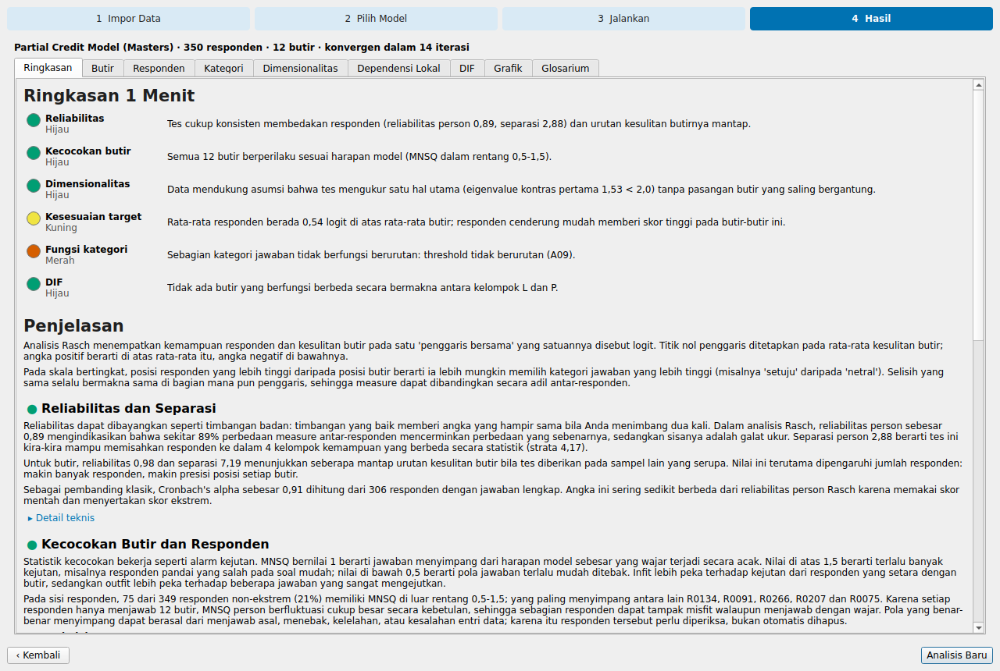
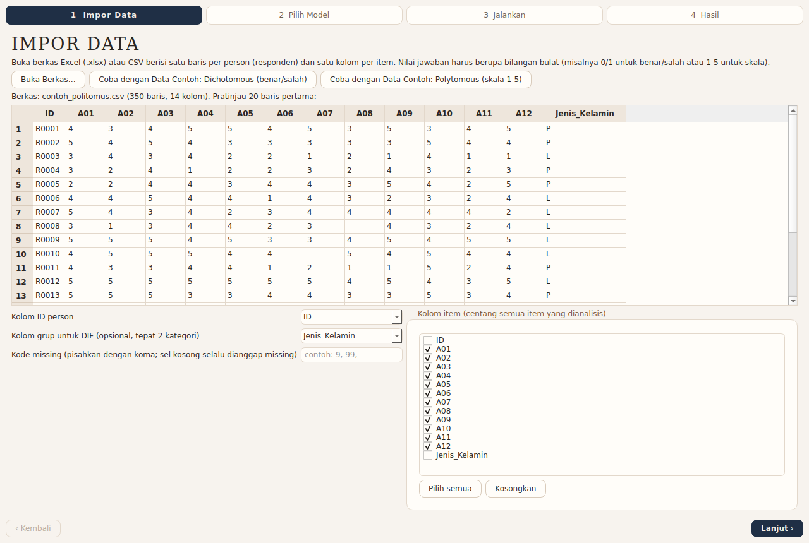
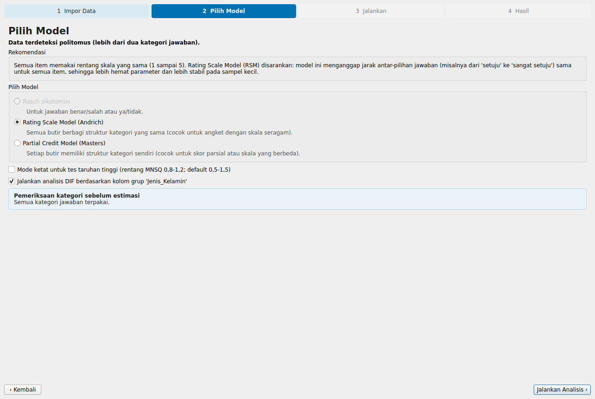
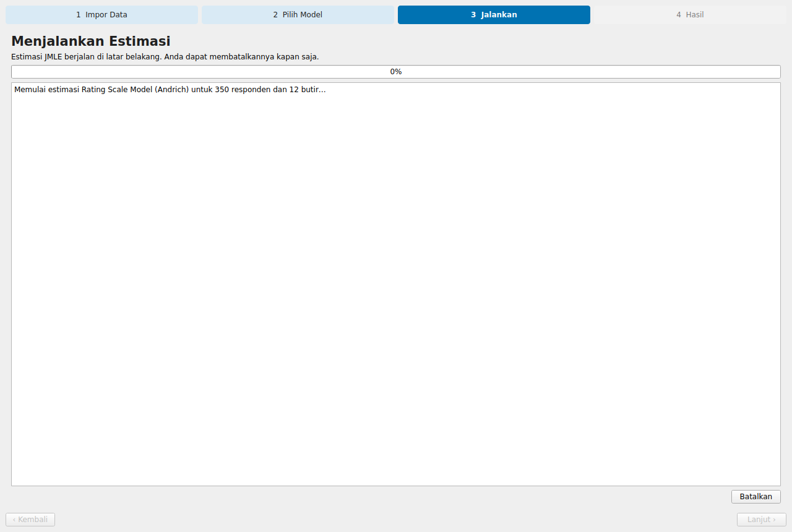
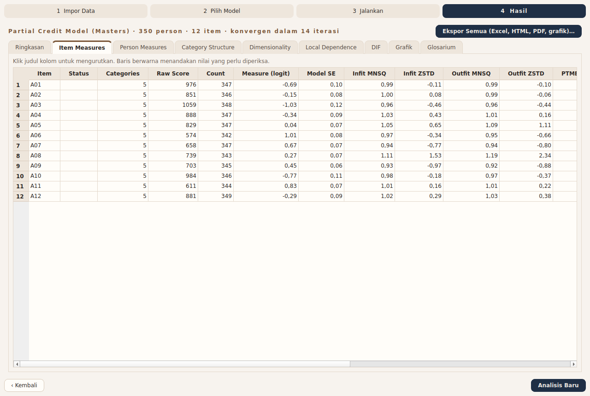
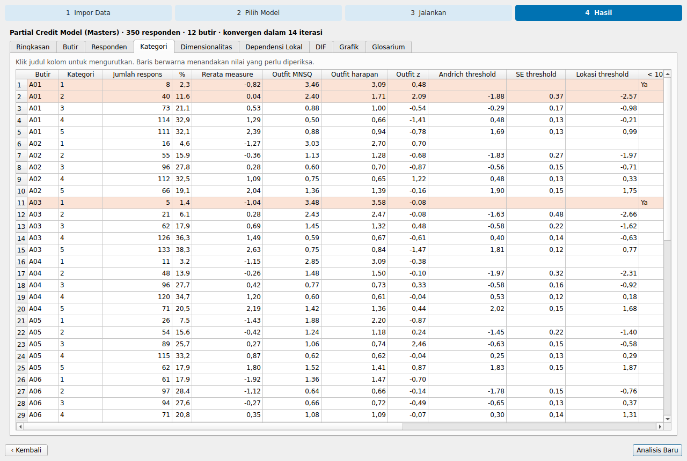
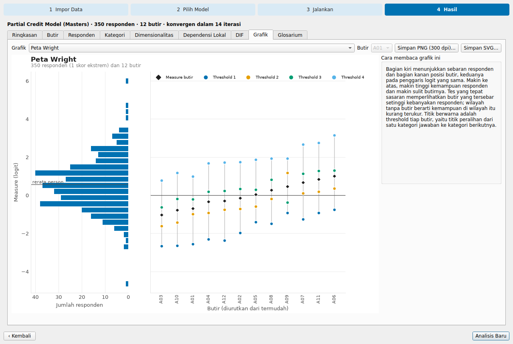

# RaschLite by CSPS

RaschLite adalah aplikasi desktop Windows yang ringan dan sepenuhnya luring untuk analisis Rasch: Dichotomous Rasch Model (1PL), Rating Scale Model (Andrich), dan Partial Credit Model (Masters). Aplikasi ini mengestimasi parameter dengan JMLE, menyajikan tabel statistik item, person, kategori, dimensionalitas, local dependence, dan DIF, menghasilkan sepuluh grafik berkualitas publikasi, lalu menafsirkan semuanya dalam bahasa Indonesia untuk pembaca awam. Istilah teknis Rasch (Item, Person, Measure, Person Reliability, Separation, Infit/Outfit MNSQ, Andrich Threshold, Wright Map, dan seterusnya) sengaja dipertahankan dalam bahasa Inggris aslinya agar tetap selaras dengan literatur dan perangkat lunak lain; penjelasan, analogi, dan saran tindakannya ditulis dalam bahasa Indonesia.

Seluruh perhitungan dan penafsiran berjalan di komputer pengguna. Aplikasi tidak melakukan panggilan internet dan tidak memakai model bahasa: narasi disusun oleh mesin aturan yang semua ambang batasnya terkumpul di satu berkas, `src/raschlite/interpret/rules.py`.



## Versi HTML (tanpa instalasi)

Selain aplikasi Windows, RaschLite tersedia sebagai satu berkas [`web/RaschLite.html`](web/RaschLite.html) (sekitar 380 KB) yang cukup dibuka dengan klik ganda di browser modern. Versi ini bekerja sepenuhnya luring dan memiliki alur, tabel, grafik, narasi, serta ekspor Excel/HTML/PDF/grafik yang sama dengan versi desktop. Angka dan narasinya diuji identik dengan engine Python terhadap golden file (lihat [`web/README.md`](web/README.md)).

## Daftar isi

1. [Instalasi untuk pengguna Windows](#instalasi-untuk-pengguna-windows)
2. [Cara pakai](#cara-pakai)
3. [Format data](#format-data)
4. [Keluaran](#keluaran)
5. [Menjalankan dari kode sumber](#menjalankan-dari-kode-sumber)
6. [Membangun installer Windows](#membangun-installer-windows)
7. [Verifikasi di mesin Windows yang bersih](#verifikasi-di-mesin-windows-yang-bersih)
8. [Pengujian dan bukti penerimaan](#pengujian-dan-bukti-penerimaan)
9. [Metode](#metode)
10. [Batasan metode](#batasan-metode)
11. [Struktur proyek](#struktur-proyek)

## Instalasi untuk pengguna Windows

Jalankan `RaschLite-<versi>-setup.exe` (dibuat dengan langkah pada bagian [Membangun installer Windows](#membangun-installer-windows)). Installer tidak memerlukan hak administrator: secara bawaan aplikasi dipasang ke `%LOCALAPPDATA%\Programs\RaschLite`, dan pengguna dapat memilih instalasi untuk semua pengguna bila memiliki hak administrator. Aplikasi memerlukan Windows 10 atau 11 versi 64-bit dan tidak memerlukan Python, R, atau koneksi internet. Sebagai alternatif tanpa installer, folder `dist\RaschLite` hasil build dapat disalin utuh ke lokasi mana pun lalu `RaschLite.exe` dijalankan langsung.

## Cara pakai

Analisis berjalan sebagai wizard empat langkah. Setiap langkah dapat diulang dengan tombol **‹ Kembali**, dan tombol **Analisis Baru** membawa pengguna kembali ke awal.

**Langkah 1, Impor Data.** Buka berkas `.xlsx` atau `.csv`, atau tekan salah satu tombol data contoh untuk mencoba aplikasi tanpa menyiapkan data. Aplikasi menebak kolom ID dan kolom item, menampilkan pratinjau 20 baris pertama, dan menerima kode missing tambahan (misalnya `9, 99`). Kolom grup bersifat opsional dan hanya dipakai untuk DIF bila berisi tepat dua kategori. Kesalahan data, misalnya nilai bukan bilangan bulat, ditampilkan langsung di bawah formulir beserta baris dan kolomnya.



**Langkah 2, Pilih Model.** Aplikasi mendeteksi apakah data dichotomous atau polytomous dan merekomendasikan model beserta alasannya. Sebelum estimasi, kategori jawaban yang tidak terpakai diperiksa dan dilaporkan. Mode ketat (rentang MNSQ 0,8–1,2 untuk tes high-stakes) dan analisis DIF dapat diaktifkan di halaman ini.



**Langkah 3, Jalankan.** Estimasi berjalan di thread terpisah sehingga jendela tetap responsif, dengan bilah kemajuan, log iterasi (max logit change dan max score residual), serta tombol **Batalkan**. Bila estimasi tidak konvergen dalam 500 iterasi, peringatan yang jelas ditampilkan di hasil dan laporan.



**Langkah 4, Hasil.** Tab **Ringkasan** memuat Ringkasan 1 Menit berupa enam lampu (Reliability, Item Fit, Dimensionality, Targeting, Category Functioning, DIF) yang selalu disertai label status tertulis, lalu Penjelasan untuk orang awam dan Detail teknis yang dapat dibuka beserta kriteria dan rujukannya. Tab berikutnya berisi tabel yang dapat diurutkan dengan mengeklik judul kolom: **Item Measures**, **Person Measures**, **Category Structure**, **Dimensionality**, **Local Dependence**, dan **DIF**. Baris yang perlu diperiksa diberi warna terakota pucat, baris extreme score diberi warna pasir, dan judul kolom menampilkan tooltip glosarium.





Tab **Grafik** menampilkan kesepuluh grafik; grafik per item dapat dipilih lewat kotak Item, dan setiap grafik disertai panel **Cara membaca grafik ini**. Grafik dapat disimpan sendiri-sendiri sebagai PNG 300 dpi atau SVG. Tab **Glosarium** menjelaskan setiap istilah dalam bahasa awam.



**Ekspor.** Tombol **Ekspor Semua (Excel, HTML, PDF, grafik)…** meminta satu folder tujuan lalu menulis `laporan_raschlite.xlsx` (satu sheet per tabel), `laporan_raschlite.html` (satu berkas mandiri, gambar tertanam base64, tanpa sumber eksternal), `laporan_raschlite.pdf`, dan folder `grafik` berisi semua grafik dalam PNG 300 dpi dan SVG. Contoh keluarannya ada di [`preview/laporan/`](preview/laporan/), sedangkan galeri grafik dan narasi lengkap untuk data contoh ada di [`preview/README.md`](preview/README.md).

## Format data

Satu baris mewakili satu person dan satu kolom mewakili satu item. Jawaban harus bilangan bulat, misalnya 0/1 untuk benar/salah atau 1–5 untuk skala Likert. Sel kosong selalu dianggap missing, dan kode missing lain dapat didaftarkan pada langkah Impor Data. Data dengan dua nilai jawaban dikodekan ulang menjadi 0/1; data polytomous dikodekan ulang menjadi kategori berurutan 0..m tanpa kategori kosong, dan setiap pengodean ulang dilaporkan sebelum estimasi. Pemisah CSV (koma, titik koma, tab, atau garis tegak) dideteksi otomatis.

## Keluaran

Tabel yang dihasilkan mengikuti nama baku Winsteps sejauh memungkinkan:

| Tabel | Isi utama |
|---|---|
| Item Measures | Raw Score, Count, Measure (logit), Model SE, Infit/Outfit MNSQ dan ZSTD, PTMEA Corr. (obs./exp.), Status, penanda Misfit dan Negative PTMEA |
| Person Measures | kolom serupa untuk setiap person, termasuk Group untuk DIF |
| Category Structure | Count, %, Observed Average, Outfit MNSQ, Expected Outfit, Outfit z, Andrich Threshold, Threshold SE, Threshold Location, penanda Disordered Threshold, Disordered Average, Count < 10, High Outfit |
| Dimensionality | First Contrast Loading setiap item, first contrast eigenvalue, raw variance explained by measures |
| Local Dependence | matriks Yen's Q3 dan pasangan item di atas batas relatif |
| DIF | measure per grup, DIF Contrast, Joint SE, Welch t, df, p, ETS Category, DIF Flag |

Sepuluh grafiknya adalah Wright Map, Item Characteristic Curve (ICC) dengan titik empiris dan interval 95%, Category Probability Curves, Expected Score Curve, Test Information Function and SEM, Item Fit Bubble Chart, Person Fit Distribution, PCA of Residuals: First Contrast, DIF Plot, dan Yen's Q3 Matrix. Palet grafik diturunkan dari gaya warna CSPS dan telah diperiksa dengan validator buta warna (pasangan bersebelahan terburuk untuk deuteranopia ΔE 10,0).

## Menjalankan dari kode sumber

Diperlukan Python 3.11 atau 3.12 versi 64-bit. Dari folder `rasch-lite`:

```powershell
py -3.11 -m venv .venv
.venv\Scripts\python -m pip install -r requirements.txt
$env:PYTHONPATH = "src"
.venv\Scripts\python -m raschlite
```

Di Linux atau macOS gunakan `python3.11 -m venv .venv`, `.venv/bin/python -m pip install -r requirements.txt`, lalu `PYTHONPATH=src .venv/bin/python -m raschlite`. Di Linux, Qt memerlukan pustaka sistem `libEGL.so.1` dan `libxcb-cursor0`; keduanya sudah tersedia pada desktop Linux umumnya, tetapi sering tidak ada di container atau server tanpa layar.

Dua opsi baris perintah tersedia untuk verifikasi, baik dari kode sumber maupun dari executable:

| Opsi | Fungsi |
|---|---|
| `--self-test <folder>` | Menjalankan ketiga model pada data contoh, mengekspor semua laporan, menjalankan alur GUI lengkap, dan menguji dua target performa. Hasil ditulis ke `<folder>\selftest_result.txt`; kode keluar 0 berarti semua lulus. |
| `--startup-check <berkas>` | Membuka jendela utama, menulis waktu sampai jendela tampil ke `<berkas>`, lalu keluar. |

## Membangun installer Windows

Pada mesin Windows 10/11 64-bit dengan Python 3.11 (atau 3.12) dari python.org beserta peluncur `py`, dan bila ingin membuat installer, Inno Setup 6.3 atau lebih baru, jalankan dari folder `rasch-lite`:

```powershell
powershell -ExecutionPolicy Bypass -File scripts\build_windows.ps1
```

Skrip membuat virtualenv `.venv-win`, memasang dependensi terkunci dari `requirements-build.txt` (yang juga memuat `requirements.txt` serta PyInstaller 6.22.3), menjalankan seluruh pytest dengan `QT_QPA_PLATFORM=offscreen`, membangun `dist\RaschLite` dengan `raschlite.spec` (mode `--onedir`, tanpa UPX), melaporkan ukuran folder dan sepuluh berkas terbesar, menjalankan `--self-test` dan tiga kali `--startup-check` pada executable, lalu memanggil `ISCC.exe` bila Inno Setup ditemukan. Ringkasannya ditulis ke `dist\build_report.txt`, dan installer ke `dist\installer\RaschLite-<versi>-setup.exe`. Parameter `-SkipTests`, `-SkipInstaller`, dan `-PythonVersion 3.12` tersedia. Bila Inno Setup dipasang belakangan, installer dapat dibuat terpisah dengan `ISCC.exe /DMyAppVersion=0.1.0 installer\raschlite.iss`.

Spec PyInstaller menghemat ukuran tanpa mengurangi fungsi. Hanya modul Qt yang benar-benar diimpor yang dikumpulkan; hook lokal `pyinstaller_hooks/hook-PySide6.QtGui.py` memangkas plugin Qt menjadi platform desktop, tiga format gambar kecil, dan metode input; terjemahan Qt, `opengl32sw.dll`, modul AVIF Pillow, serta subpaket SciPy yang tidak dipakai dikecualikan. Build uji di Linux (lihat bagian berikut) berukuran 247,3 MB, dan sebagian besar selisihnya terhadap Windows berasal dari pustaka yang hanya ada di Linux, terutama ICU (37,3 MB) yang tidak ikut pada build Windows. Ukuran Windows yang sebenarnya dilaporkan oleh skrip build; pemetaan setiap berkas build Linux ke padanannya di wheel `win_amd64` resmi memberi perkiraan sekitar 158 MB, jauh di bawah batas 250 MB.

## Verifikasi di mesin Windows yang bersih

Verifikasi akhir dilakukan pada Windows 10/11 64-bit yang belum pernah dipasangi Python, sebaiknya mesin virtual baru. Salin installer, pasang dengan akun pengguna biasa, lalu jalankan RaschLite dari menu Start dan coba kedua data contoh sampai ekspor selesai. Setelah itu jalankan uji mandiri dari PowerShell:

```powershell
$exe = "$env:LOCALAPPDATA\Programs\RaschLite\RaschLite.exe"
$out = "$env:USERPROFILE\Desktop\raschlite_selftest"
$p = Start-Process $exe -ArgumentList "--self-test `"$out`"" -Wait -PassThru
$p.ExitCode
Get-Content "$out\selftest_result.txt"
```

Kode keluar 0 dan baris terakhir `HASIL: LULUS` berarti estimasi, ekspor Excel/HTML/PDF/grafik, alur GUI, dan kedua target performa berhasil pada mesin tersebut. Untuk mengukur cold start, nyalakan ulang mesin lalu jalankan `--startup-check` sekali; targetnya jendela tampil kurang dari 4 detik. Peluncuran pertama setelah instalasi dapat sedikit lebih lambat karena pemindaian antivirus, dan pembukaan hasil pertama kali membuat cache font matplotlib satu kali.

## Pengujian dan bukti penerimaan

```powershell
$env:PYTHONPATH = "src"; $env:QT_QPA_PLATFORM = "offscreen"
.venv\Scripts\python -m pytest -q
```

Suite berisi 104 tes yang mencakup validasi data, recovery parameter, deteksi pola yang disimulasikan, rumus yang dibandingkan dengan implementasi brute-force independen, kontrol estimasi (peringatan tidak konvergen, pembatalan, isolasi engine dari Qt), interpretasi, kebijakan istilah, grafik, ekspor, performa, startup ringan beserta opsi verifikasi build, dan smoke test GUI headless. Di akhir sesi pytest mencetak tabel recovery dan deteksi berisi nilai aktual. Nilai berikut berasal dari jalannya suite terakhir di Linux (Python 3.11):

| Kriteria penerimaan | Hasil aktual |
|---|---|
| Recovery dichotomous N=1000, L=30 | r = 0,9976–0,9982; RMSE 0,074–0,094 logit (3 seed) |
| Missing data 10% | r = 0,9969–0,9985 (syarat r ≥ 0,95) |
| Recovery RSM / PCM | r_tau RSM 0,9999–1,0000; r_delta PCM 0,9964–0,9976 |
| Item acak terdeteksi (outfit > 1,3) | outfit 1,389–1,479; outfit maksimum item lain 1,005–1,058 |
| Disordered threshold ditandai | RSM kategori 3; PCM item I05 |
| DIF terdeteksi | dua item yang disisipkan, t −3,97 sampai −7,63 (ambang 2,0) |
| Data dua dimensi | first contrast eigenvalue 2,55–2,75 (syarat > 2); kontrol unidimensi 1,38 |
| Performa 2000×50 dichotomous | 0,58–0,67 detik (target < 5) |
| Performa 1000×30 PCM 5 kategori | 0,34–0,40 detik (target < 10) |
| Startup dari kode sumber | jendela tampil 0,78–0,80 detik |
| Build beku Linux | 247,3 MB; uji mandiri lulus 19/19; jendela tampil 0,62–0,77 detik |

## Metode

Estimasi memakai Joint Maximum Likelihood Estimation (JMLE) dengan nilai awal PROX dan langkah Newton-Raphson Gauss-Seidel yang dibatasi maksimum 1 logit per iterasi. Estimasi dinyatakan konvergen bila perubahan estimasi maksimum kurang dari 0,001 logit dan residual skor maksimum kurang dari 0,01, dengan batas 500 iterasi. Ketiga model memakai parameterisasi Masters yang sama, δ_ik = b_i + τ_ik; RSM membagi τ yang sama ke semua item, sedangkan PCM memberi τ tersendiri bagi setiap item. Item measure dan threshold dikoreksi dengan faktor (L−1)/L (Wright & Douglas, 1977), sedangkan statistik fit dihitung dari solusi sebelum koreksi seperti pada Winsteps. Rata-rata item measure ditetapkan 0. Person dan item dengan extreme score dikeluarkan dari estimasi lalu diberi measure dengan penyesuaian skor 0,3 poin dan ditandai.

Statistik fit mengikuti Wright dan Masters (1982), dengan ZSTD melalui transformasi Wilson-Hilferty dan point-measure correlation yang dibandingkan dengan nilai harapannya. Reliability dan separation dilaporkan dalam versi REAL (utama) dan MODEL, strata dihitung sebagai (4G + 1)/3, dan Cronbach's alpha (KR-20 untuk data dichotomous) ditambahkan sebagai pembanding klasik. Analisis kategori memuat observed average, category outfit beserta nilai harapannya, dan Andrich threshold. Dimensionalitas diperiksa dengan PCA atas standardized residual, local dependence dengan Yen's Q3 memakai batas relatif rata-rata Q3 + 0,2 (Christensen dkk., 2017), dan DIF dengan mengunci person measure lalu mengestimasi ulang item measure per grup, menandai item bila DIF contrast mutlak ≥ 0,5 logit dan t mutlak melampaui 2,0 (atau 2,4 bila lebih dari 20 item) mengikuti Draba (1977), disertai kategori ETS A/B/C.

Semua ambang interpretasi, termasuk rentang MNSQ 0,5–1,5 (produktif) dan 0,8–1,2 (ketat), batas person reliability 0,80 dan 0,67, batas eigenvalue 2 dan 3, serta tafsiran teraman tabel targeting Fisher (2007), tercatat bersama rujukannya di `src/raschlite/interpret/rules.py`.

## Batasan metode

JMLE tidak konsisten bila jumlah item kecil, karena parameter person ikut diestimasi bersama parameter item. Koreksi (L−1)/L mengurangi bias itu tetapi hanya bersifat pendekatan; untuk tes yang sangat pendek atau keputusan high-stakes, hasil sebaiknya dibandingkan dengan CMLE atau MML dari perangkat lunak lain, sebab RaschLite sengaja hanya menyediakan JMLE. Measure untuk extreme score bergantung pada penyesuaian 0,3 poin yang bersifat konvensi, sehingga posisi person dengan skor nol atau sempurna tidak boleh ditafsirkan setara dengan measure person lain.

Ambang fit, reliability, eigenvalue, Q3, dan targeting adalah pedoman empiris, bukan uji yang memiliki tingkat galat tertentu. ZSTD sangat peka terhadap ukuran sampel, sehingga MNSQ lebih diutamakan untuk menilai besarnya masalah. Batas eigenvalue first contrast dan batas relatif Q3 dipengaruhi jumlah item, jumlah person, dan sebaran measure; hasil di sekitar batas perlu ditelaah dari isi item, bukan diputuskan dari angka saja. Raw variance explained by measures sangat dipengaruhi sebaran measure dan karena itu tidak dipakai sebagai kriteria.

Analisis DIF hanya membandingkan dua grup dan hanya mendeteksi DIF uniform; DIF non-uniform, lebih dari dua grup, serta analisis DPF dan DGF tidak tersedia. Missing data diperlakukan sebagai ignorable (missing at random); bila jawaban kosong berkaitan dengan kemampuan, misalnya soal yang dilewati karena sulit, measure dapat bias. Model multidimensi, many-facet, dan model dengan parameter diskriminasi berada di luar cakupan aplikasi ini.

Narasi interpretasi dihasilkan oleh aturan tetap, sehingga konsisten tetapi tidak memahami isi item, konteks pengukuran, maupun tujuan penggunaan skor. Narasi sengaja memakai bahasa yang berhati-hati dan tidak menyatakan kesimpulan kausal; keputusan untuk mengeluarkan item atau person, menggabungkan kategori, atau menyatakan bias tetap memerlukan pertimbangan ahli.

## Struktur proyek

```
rasch-lite/
├── src/raschlite/
│   ├── core/          engine statistik murni Python (tanpa Qt): data, JMLE, fit, kategori, PCA, Q3, DIF
│   ├── interpret/     rules.py (semua ambang dan rujukan), narrative.py, glossary.py
│   ├── plots/         sepuluh grafik matplotlib (tanpa pyplot) dan registri "Cara membaca"
│   ├── gui/           PySide6 (QtCore/QtGui/QtWidgets): wizard, panel hasil, strings.py, style.py
│   ├── report/        ekspor Excel, HTML (Jinja2), PDF (QTextDocument + QPdfWriter)
│   ├── resources/     data contoh
│   ├── theme.py       satu sumber warna bergaya CSPS
│   └── selftest.py    uji mandiri untuk build beku
├── tests/             pytest (104 tes)
├── scripts/           build_windows.ps1, launch_raschlite.py (skrip masuk PyInstaller)
├── installer/         raschlite.iss (Inno Setup 6)
├── pyinstaller_hooks/ hook lokal pemangkas plugin Qt
├── preview/           galeri grafik, narasi, contoh laporan, tangkapan layar GUI
├── raschlite.spec     spesifikasi PyInstaller --onedir
├── requirements.txt   dependensi runtime terkunci (+ pytest)
└── requirements-build.txt
```

Pustaka pihak ketiga tetap tunduk pada lisensinya masing-masing. PySide6 dan Qt didistribusikan di bawah LGPLv3; build `--onedir` menyimpan DLL Qt sebagai berkas terpisah di folder aplikasi sehingga dapat diganti, tetapi kepatuhan lisensi untuk distribusi tetap perlu diperiksa oleh penerbit.
