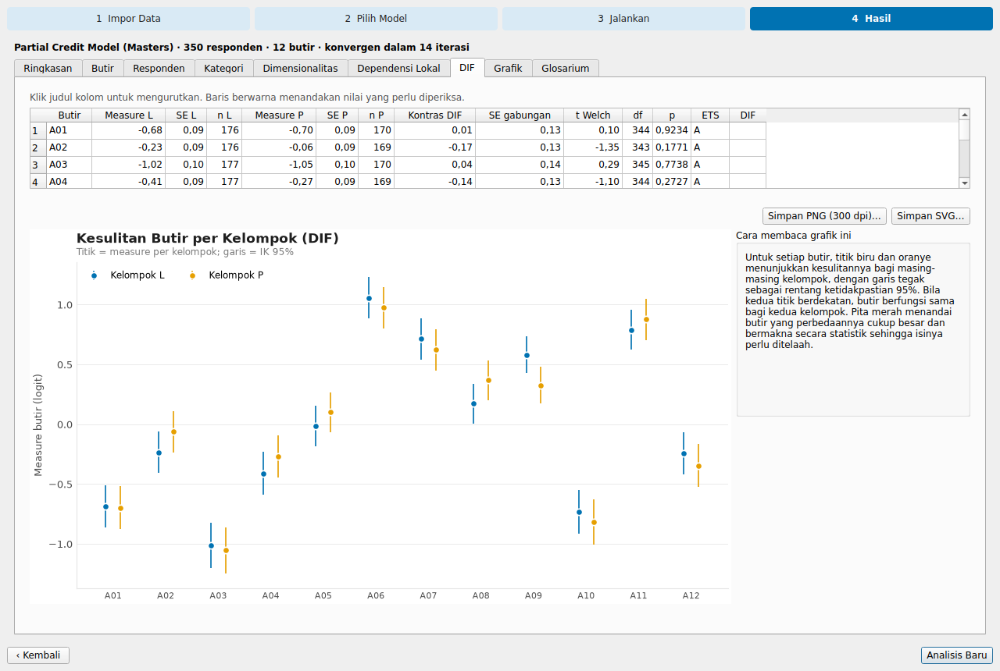

# Pratinjau Fase 2: grafik dan narasi dari data contoh

Dibangkitkan oleh RaschLite 0.1.0 dari `src/raschlite/resources/sample_data/`. Semua grafik PNG 300 dpi. Font pratinjau: DejaVu Sans (Segoe UI tidak tersedia di Linux; di Windows grafik otomatis memakai Segoe UI). Grafik per butir ditampilkan untuk butir yang representatif; ekspor di aplikasi akan menghasilkan grafik untuk semua butir dalam PNG dan SVG.

## Rasch dikotomus (`contoh_dikotomus.csv`)

## Ringkasan 1 Menit (Rasch dikotomus)

- 🟡 **Reliabilitas** (Kuning): Konsistensi pengukuran memadai tetapi belum ideal (reliabilitas person 0,77).
- 🟡 **Kecocokan butir** (Kuning): 1 butir berada di luar rentang kecocokan 0,5-1,5 dan perlu diperiksa: S07.
- 🟢 **Dimensionalitas** (Hijau): Data mendukung asumsi bahwa tes mengukur satu hal utama (eigenvalue kontras pertama 1,42 < 2,0) tanpa pasangan butir yang saling bergantung.
- 🟢 **Kesesuaian target** (Hijau): Tingkat kesulitan butir sesuai dengan kemampuan responden (selisih rata-rata 0,25 logit).
- ⚪ **Fungsi kategori** (Abu-abu): Tidak berlaku: data dikotomus hanya memiliki dua kategori.
- 🔴 **DIF** (Merah): 1 butir menunjukkan DIF besar antar-kelompok dan perlu ditelaah isinya: S12.

Narasi lengkap tiga lapis: [narasi_dikotomus.md](narasi_dikotomus.md)

### Peta Wright

**Cara membaca grafik ini.** Bagian kiri menunjukkan sebaran responden dan bagian kanan posisi butir, keduanya pada penggaris logit yang sama. Makin ke atas, makin tinggi kemampuan responden dan makin sulit butirnya. Tes yang tepat sasaran memperlihatkan butir yang tersebar setinggi kebanyakan responden; wilayah tanpa butir berarti kemampuan di wilayah itu kurang terukur.

### Kurva Karakteristik Butir

**Cara membaca grafik ini.** Garis biru menunjukkan peluang menjawab benar (atau skor harapan) yang diperkirakan model pada setiap tingkat kemampuan. Titik oranye adalah rata-rata jawaban kelompok responden yang kemampuannya mirip, dengan garis tegak sebagai rentang ketidakpastian 95%. Bila titik-titik mengikuti garis, butir berperilaku sesuai model; titik yang jauh dari garis menandakan butir yang perlu diperiksa.

### Fungsi Informasi Tes dan SEM

**Cara membaca grafik ini.** Garis biru (sumbu kiri) menunjukkan seberapa banyak informasi yang diberikan tes pada setiap tingkat kemampuan; makin tinggi, makin presisi. Garis oranye (sumbu kanan) adalah galat baku pengukuran, kebalikannya: makin rendah, makin presisi. Tes paling tepat untuk responden yang kemampuannya berada di sekitar puncak garis biru.

### Peta Kecocokan Butir

**Cara membaca grafik ini.** Setiap gelembung adalah satu butir: posisi mendatar menunjukkan kesulitan dan posisi tegak menunjukkan nilai kecocokan (MNSQ). Butir di dalam pita hijau berperilaku sesuai harapan; butir merah di atas pita terlalu 'berisik', di bawah pita terlalu mudah ditebak. Gelembung besar berarti estimasi butir itu kurang presisi.

### Distribusi Kecocokan Responden

**Cara membaca grafik ini.** Histogram menunjukkan sebaran nilai kecocokan responden. Sebagian besar responden seharusnya berada di pita hijau di sekitar 1,0. Ekor panjang ke kanan menandakan responden dengan pola jawaban tak terduga, misalnya menebak atau menjawab asal.

### Kontras Pertama PCA Residual

**Cara membaca grafik ini.** Setiap titik adalah satu butir; posisi tegaknya menunjukkan keterkaitan butir dengan pola sisa terkuat setelah kemampuan utama dikeluarkan. Bila butir bertitik biru dan oranye membentuk dua kelompok isi yang berbeda, tes mungkin mengukur dua hal. Eigenvalue di bawah 2 menandakan pola sisa tersebut masih wajar terjadi secara kebetulan.

### Kesulitan Butir per Kelompok (DIF)

**Cara membaca grafik ini.** Untuk setiap butir, titik biru dan oranye menunjukkan kesulitannya bagi masing-masing kelompok, dengan garis tegak sebagai rentang ketidakpastian 95%. Bila kedua titik berdekatan, butir berfungsi sama bagi kedua kelompok. Pita merah menandai butir yang perbedaannya cukup besar dan bermakna secara statistik sehingga isinya perlu ditelaah.

### Matriks Yen's Q3

**Cara membaca grafik ini.** Setiap kotak menunjukkan keterkaitan sisa jawaban antara dua butir. Warna pucat berarti tidak ada keterkaitan tambahan; merah pekat berarti dua butir saling terkait di luar kemampuan yang diukur, biru berarti berlawanan arah. Kotak berbingkai hitam adalah pasangan yang ditandai dan perlu ditelaah, misalnya karena berasal dari satu wacana.

## Rating Scale Model (Andrich) (`contoh_politomus.csv`)

## Ringkasan 1 Menit (Rating Scale Model (Andrich))

- 🟢 **Reliabilitas** (Hijau): Tes cukup konsisten membedakan responden (reliabilitas person 0,89, separasi 2,87) dan urutan kesulitan butirnya mantap.
- 🟢 **Kecocokan butir** (Hijau): Semua 12 butir berperilaku sesuai harapan model (MNSQ dalam rentang 0,5-1,5).
- 🟢 **Dimensionalitas** (Hijau): Data mendukung asumsi bahwa tes mengukur satu hal utama (eigenvalue kontras pertama 1,52 < 2,0) tanpa pasangan butir yang saling bergantung.
- 🟡 **Kesesuaian target** (Kuning): Rata-rata responden berada 0,53 logit di atas rata-rata butir; responden cenderung mudah memberi skor tinggi pada butir-butir ini.
- 🟢 **Fungsi kategori** (Hijau): Kategori jawaban berfungsi berurutan dan cukup sering dipakai.
- 🟢 **DIF** (Hijau): Tidak ada butir yang berfungsi berbeda secara bermakna antara kelompok L dan P.

Narasi lengkap tiga lapis: [narasi_politomus_rsm.md](narasi_politomus_rsm.md)

### Peta Wright

**Cara membaca grafik ini.** Bagian kiri menunjukkan sebaran responden dan bagian kanan posisi butir, keduanya pada penggaris logit yang sama. Makin ke atas, makin tinggi kemampuan responden dan makin sulit butirnya. Tes yang tepat sasaran memperlihatkan butir yang tersebar setinggi kebanyakan responden; wilayah tanpa butir berarti kemampuan di wilayah itu kurang terukur. Titik berwarna adalah threshold tiap butir, yaitu titik peralihan dari satu kategori jawaban ke kategori berikutnya.

### Kurva Karakteristik Butir

**Cara membaca grafik ini.** Garis biru menunjukkan peluang menjawab benar (atau skor harapan) yang diperkirakan model pada setiap tingkat kemampuan. Titik oranye adalah rata-rata jawaban kelompok responden yang kemampuannya mirip, dengan garis tegak sebagai rentang ketidakpastian 95%. Bila titik-titik mengikuti garis, butir berperilaku sesuai model; titik yang jauh dari garis menandakan butir yang perlu diperiksa.

### Kurva Peluang Kategori

**Cara membaca grafik ini.** Setiap kurva menunjukkan peluang memilih satu kategori jawaban pada berbagai tingkat kemampuan. Garis tegak adalah threshold, titik tempat dua kategori bersebelahan sama mungkinnya. Pada skala yang berfungsi baik, setiap kategori punya puncak sendiri dan threshold berurutan dari kiri ke kanan; garis merah menandai threshold yang tidak berurutan.

### Kurva Skor Harapan

**Cara membaca grafik ini.** Kurva menunjukkan skor yang diharapkan pada butir ini untuk setiap tingkat kemampuan. Pita berselang-seling menandai rentang kemampuan tempat skor harapan paling dekat dengan suatu kategori. Pita yang sangat sempit berarti kategori itu jarang menjadi skor yang diharapkan bagi tingkat kemampuan mana pun.

### Fungsi Informasi Tes dan SEM

**Cara membaca grafik ini.** Garis biru (sumbu kiri) menunjukkan seberapa banyak informasi yang diberikan tes pada setiap tingkat kemampuan; makin tinggi, makin presisi. Garis oranye (sumbu kanan) adalah galat baku pengukuran, kebalikannya: makin rendah, makin presisi. Tes paling tepat untuk responden yang kemampuannya berada di sekitar puncak garis biru.

### Peta Kecocokan Butir

**Cara membaca grafik ini.** Setiap gelembung adalah satu butir: posisi mendatar menunjukkan kesulitan dan posisi tegak menunjukkan nilai kecocokan (MNSQ). Butir di dalam pita hijau berperilaku sesuai harapan; butir merah di atas pita terlalu 'berisik', di bawah pita terlalu mudah ditebak. Gelembung besar berarti estimasi butir itu kurang presisi.

### Distribusi Kecocokan Responden

**Cara membaca grafik ini.** Histogram menunjukkan sebaran nilai kecocokan responden. Sebagian besar responden seharusnya berada di pita hijau di sekitar 1,0. Ekor panjang ke kanan menandakan responden dengan pola jawaban tak terduga, misalnya menebak atau menjawab asal.

### Kontras Pertama PCA Residual

**Cara membaca grafik ini.** Setiap titik adalah satu butir; posisi tegaknya menunjukkan keterkaitan butir dengan pola sisa terkuat setelah kemampuan utama dikeluarkan. Bila butir bertitik biru dan oranye membentuk dua kelompok isi yang berbeda, tes mungkin mengukur dua hal. Eigenvalue di bawah 2 menandakan pola sisa tersebut masih wajar terjadi secara kebetulan.

### Kesulitan Butir per Kelompok (DIF)

**Cara membaca grafik ini.** Untuk setiap butir, titik biru dan oranye menunjukkan kesulitannya bagi masing-masing kelompok, dengan garis tegak sebagai rentang ketidakpastian 95%. Bila kedua titik berdekatan, butir berfungsi sama bagi kedua kelompok. Pita merah menandai butir yang perbedaannya cukup besar dan bermakna secara statistik sehingga isinya perlu ditelaah.

### Matriks Yen's Q3

**Cara membaca grafik ini.** Setiap kotak menunjukkan keterkaitan sisa jawaban antara dua butir. Warna pucat berarti tidak ada keterkaitan tambahan; merah pekat berarti dua butir saling terkait di luar kemampuan yang diukur, biru berarti berlawanan arah. Kotak berbingkai hitam adalah pasangan yang ditandai dan perlu ditelaah, misalnya karena berasal dari satu wacana.

## Partial Credit Model (Masters) (`contoh_politomus.csv`)

## Ringkasan 1 Menit (Partial Credit Model (Masters))

- 🟢 **Reliabilitas** (Hijau): Tes cukup konsisten membedakan responden (reliabilitas person 0,89, separasi 2,88) dan urutan kesulitan butirnya mantap.
- 🟢 **Kecocokan butir** (Hijau): Semua 12 butir berperilaku sesuai harapan model (MNSQ dalam rentang 0,5-1,5).
- 🟢 **Dimensionalitas** (Hijau): Data mendukung asumsi bahwa tes mengukur satu hal utama (eigenvalue kontras pertama 1,53 < 2,0) tanpa pasangan butir yang saling bergantung.
- 🟡 **Kesesuaian target** (Kuning): Rata-rata responden berada 0,54 logit di atas rata-rata butir; responden cenderung mudah memberi skor tinggi pada butir-butir ini.
- 🔴 **Fungsi kategori** (Merah): Sebagian kategori jawaban tidak berfungsi berurutan: threshold tidak berurutan (A09).
- 🟢 **DIF** (Hijau): Tidak ada butir yang berfungsi berbeda secara bermakna antara kelompok L dan P.

Narasi lengkap tiga lapis: [narasi_politomus_pcm.md](narasi_politomus_pcm.md)

### Peta Wright

**Cara membaca grafik ini.** Bagian kiri menunjukkan sebaran responden dan bagian kanan posisi butir, keduanya pada penggaris logit yang sama. Makin ke atas, makin tinggi kemampuan responden dan makin sulit butirnya. Tes yang tepat sasaran memperlihatkan butir yang tersebar setinggi kebanyakan responden; wilayah tanpa butir berarti kemampuan di wilayah itu kurang terukur. Titik berwarna adalah threshold tiap butir, yaitu titik peralihan dari satu kategori jawaban ke kategori berikutnya.

### Kurva Karakteristik Butir

**Cara membaca grafik ini.** Garis biru menunjukkan peluang menjawab benar (atau skor harapan) yang diperkirakan model pada setiap tingkat kemampuan. Titik oranye adalah rata-rata jawaban kelompok responden yang kemampuannya mirip, dengan garis tegak sebagai rentang ketidakpastian 95%. Bila titik-titik mengikuti garis, butir berperilaku sesuai model; titik yang jauh dari garis menandakan butir yang perlu diperiksa.

### Kurva Peluang Kategori

**Cara membaca grafik ini.** Setiap kurva menunjukkan peluang memilih satu kategori jawaban pada berbagai tingkat kemampuan. Garis tegak adalah threshold, titik tempat dua kategori bersebelahan sama mungkinnya. Pada skala yang berfungsi baik, setiap kategori punya puncak sendiri dan threshold berurutan dari kiri ke kanan; garis merah menandai threshold yang tidak berurutan.

### Kurva Skor Harapan

**Cara membaca grafik ini.** Kurva menunjukkan skor yang diharapkan pada butir ini untuk setiap tingkat kemampuan. Pita berselang-seling menandai rentang kemampuan tempat skor harapan paling dekat dengan suatu kategori. Pita yang sangat sempit berarti kategori itu jarang menjadi skor yang diharapkan bagi tingkat kemampuan mana pun.

### Fungsi Informasi Tes dan SEM

**Cara membaca grafik ini.** Garis biru (sumbu kiri) menunjukkan seberapa banyak informasi yang diberikan tes pada setiap tingkat kemampuan; makin tinggi, makin presisi. Garis oranye (sumbu kanan) adalah galat baku pengukuran, kebalikannya: makin rendah, makin presisi. Tes paling tepat untuk responden yang kemampuannya berada di sekitar puncak garis biru.

### Peta Kecocokan Butir

**Cara membaca grafik ini.** Setiap gelembung adalah satu butir: posisi mendatar menunjukkan kesulitan dan posisi tegak menunjukkan nilai kecocokan (MNSQ). Butir di dalam pita hijau berperilaku sesuai harapan; butir merah di atas pita terlalu 'berisik', di bawah pita terlalu mudah ditebak. Gelembung besar berarti estimasi butir itu kurang presisi.

### Distribusi Kecocokan Responden

**Cara membaca grafik ini.** Histogram menunjukkan sebaran nilai kecocokan responden. Sebagian besar responden seharusnya berada di pita hijau di sekitar 1,0. Ekor panjang ke kanan menandakan responden dengan pola jawaban tak terduga, misalnya menebak atau menjawab asal.

### Kontras Pertama PCA Residual

**Cara membaca grafik ini.** Setiap titik adalah satu butir; posisi tegaknya menunjukkan keterkaitan butir dengan pola sisa terkuat setelah kemampuan utama dikeluarkan. Bila butir bertitik biru dan oranye membentuk dua kelompok isi yang berbeda, tes mungkin mengukur dua hal. Eigenvalue di bawah 2 menandakan pola sisa tersebut masih wajar terjadi secara kebetulan.

### Kesulitan Butir per Kelompok (DIF)

**Cara membaca grafik ini.** Untuk setiap butir, titik biru dan oranye menunjukkan kesulitannya bagi masing-masing kelompok, dengan garis tegak sebagai rentang ketidakpastian 95%. Bila kedua titik berdekatan, butir berfungsi sama bagi kedua kelompok. Pita merah menandai butir yang perbedaannya cukup besar dan bermakna secara statistik sehingga isinya perlu ditelaah.

### Matriks Yen's Q3

**Cara membaca grafik ini.** Setiap kotak menunjukkan keterkaitan sisa jawaban antara dua butir. Warna pucat berarti tidak ada keterkaitan tambahan; merah pekat berarti dua butir saling terkait di luar kemampuan yang diukur, biru berarti berlawanan arah. Kotak berbingkai hitam adalah pasangan yang ditandai dan perlu ditelaah, misalnya karena berasal dari satu wacana.

## Tangkapan layar GUI (Fase 3)

Diambil secara headless (`QT_QPA_PLATFORM=offscreen`, font DejaVu Sans) dari data contoh politomus dengan PCM.

