# Pratinjau keluaran RaschLite dari data contoh

Dibangkitkan oleh RaschLite 0.1.0 dari `src/raschlite/resources/sample_data/` dengan gaya warna CSPS. Istilah teknis Rasch tampil dalam bahasa Inggris aslinya, penjelasannya dalam bahasa Indonesia. Semua grafik PNG 300 dpi. Font pratinjau: DejaVu Sans (Segoe UI tidak tersedia di Linux; di Windows grafik otomatis memakai Segoe UI). Grafik per item ditampilkan untuk item yang representatif; ekspor di aplikasi menghasilkan grafik untuk semua item dalam PNG dan SVG. Contoh laporan ada di folder [laporan](laporan/) dan tangkapan layar GUI di folder [gui](gui/).

## Dichotomous Rasch Model (`contoh_dikotomus.csv`)

## Ringkasan 1 Menit (Dichotomous Rasch Model)

- 🟡 **Reliability** (Kuning): Konsistensi pengukuran memadai tetapi belum ideal (person reliability 0,77, person separation 1,83).
- 🟡 **Item Fit** (Kuning): 1 item berada di luar rentang MNSQ 0,5-1,5 dan perlu diperiksa: S07.
- 🟢 **Dimensionality** (Hijau): Data mendukung unidimensionality: tes mengukur satu hal utama (first contrast eigenvalue 1,42 < 2,0) tanpa pasangan item yang saling bergantung.
- 🟢 **Targeting** (Hijau): Tingkat kesulitan item sesuai dengan kemampuan person (selisih rata-rata measure 0,25 logit).
- ⚪ **Category Functioning** (Abu-abu): Tidak berlaku: data dichotomous hanya memiliki dua kategori.
- 🔴 **DIF** (Merah): 1 item menunjukkan DIF besar (ETS category C) dan perlu ditelaah isinya: S12.

Narasi lengkap tiga lapis: [narasi_dikotomus.md](narasi_dikotomus.md)

### Wright Map

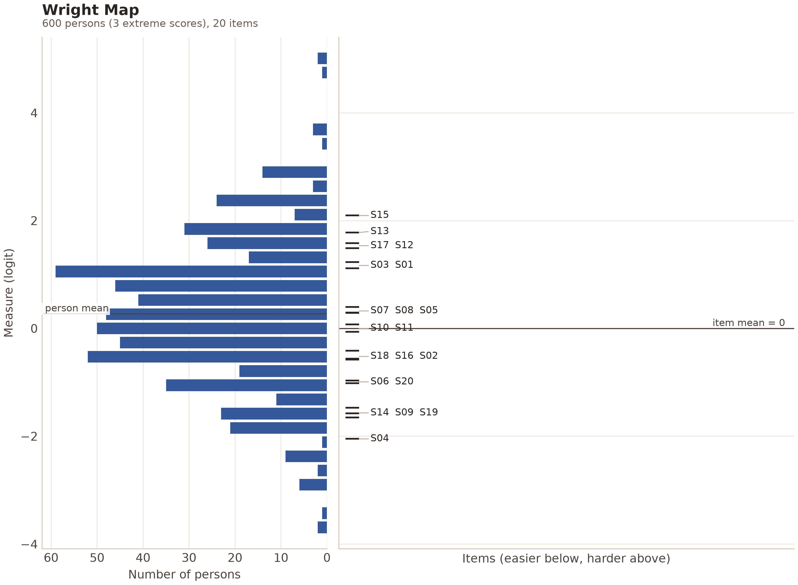

**Cara membaca grafik ini.** Bagian kiri menunjukkan sebaran person measure dan bagian kanan posisi item measure, keduanya pada penggaris logit yang sama. Makin ke atas, makin tinggi kemampuan person dan makin sulit item-nya. Tes yang well-targeted memperlihatkan item yang tersebar setinggi kebanyakan person; wilayah tanpa item berarti kemampuan di wilayah itu kurang terukur.

### Item Characteristic Curve (ICC)

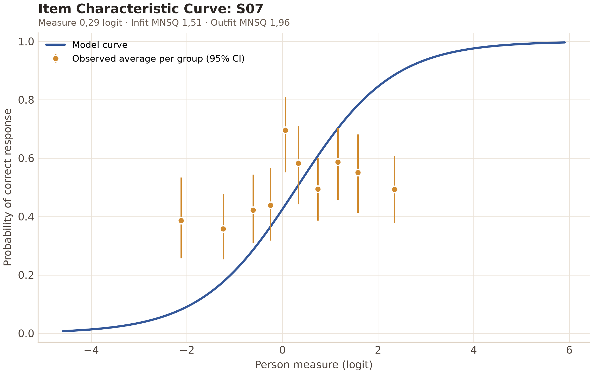

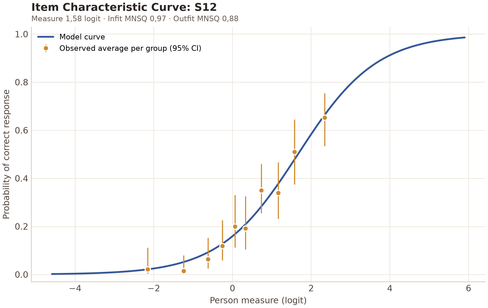

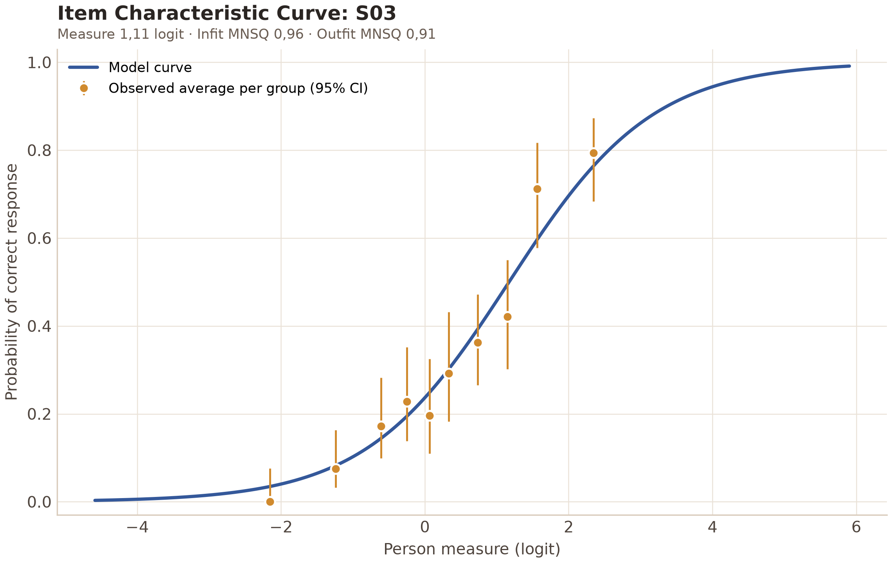

**Cara membaca grafik ini.** Garis biru adalah model curve, yaitu peluang menjawab benar (atau expected score) yang diperkirakan model pada setiap tingkat person measure. Titik oranye adalah observed average kelompok person yang kemampuannya mirip, dengan garis tegak sebagai rentang ketidakpastian 95%. Bila titik-titik mengikuti garis, item berperilaku sesuai model; titik yang jauh dari garis menandakan item yang perlu diperiksa.

### Test Information Function and SEM

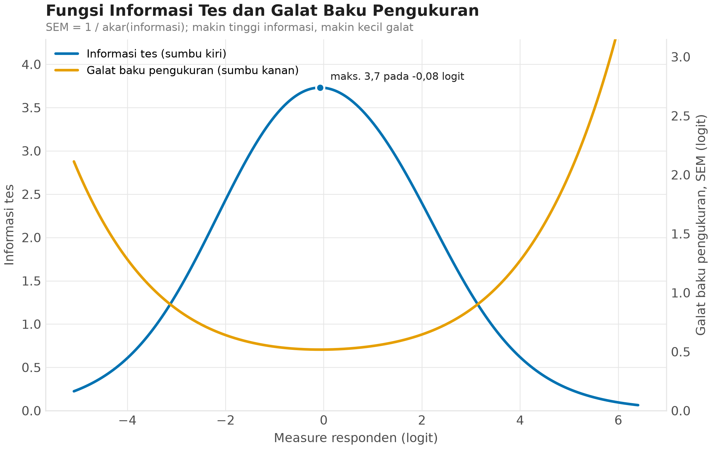

**Cara membaca grafik ini.** Garis biru (sumbu kiri) adalah test information, yaitu seberapa banyak informasi yang diberikan tes pada setiap tingkat person measure; makin tinggi, makin presisi. Garis oranye (sumbu kanan) adalah standard error of measurement (SEM), kebalikannya: makin rendah, makin presisi. Tes paling tepat untuk person yang kemampuannya berada di sekitar puncak garis biru.

### Item Fit Bubble Chart

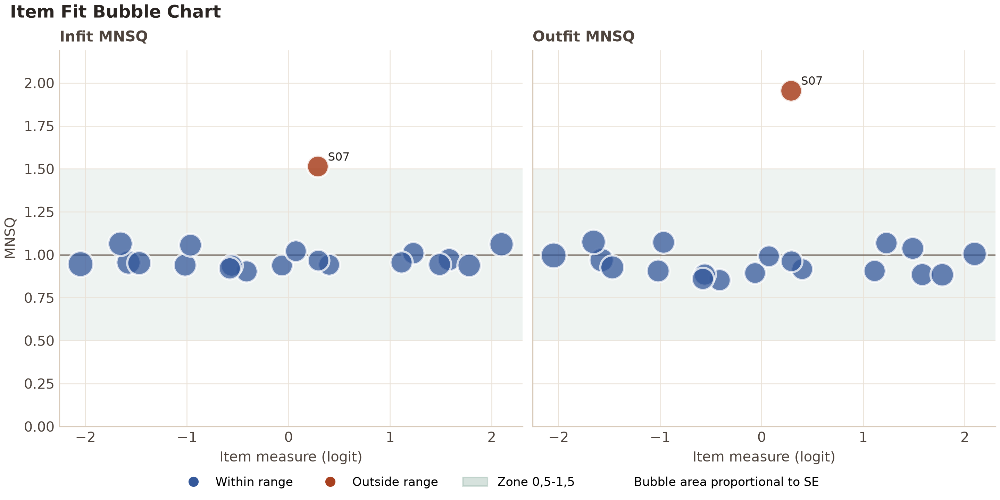

**Cara membaca grafik ini.** Setiap gelembung adalah satu item: posisi mendatar menunjukkan item measure dan posisi tegak menunjukkan Infit atau Outfit MNSQ. Item di dalam pita hijau berperilaku sesuai harapan; item merah di atas pita underfit (terlalu 'berisik'), di bawah pita overfit (terlalu mudah ditebak). Gelembung besar berarti SE item itu besar sehingga estimasinya kurang presisi.

### Person Fit Distribution

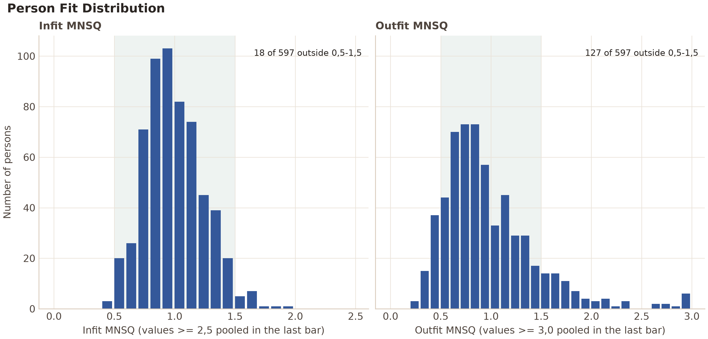

**Cara membaca grafik ini.** Histogram menunjukkan sebaran Infit dan Outfit MNSQ person. Sebagian besar person seharusnya berada di pita hijau di sekitar 1,0. Ekor panjang ke kanan menandakan person dengan pola jawaban tak terduga (underfit), misalnya menebak atau menjawab asal.

### PCA of Residuals: First Contrast

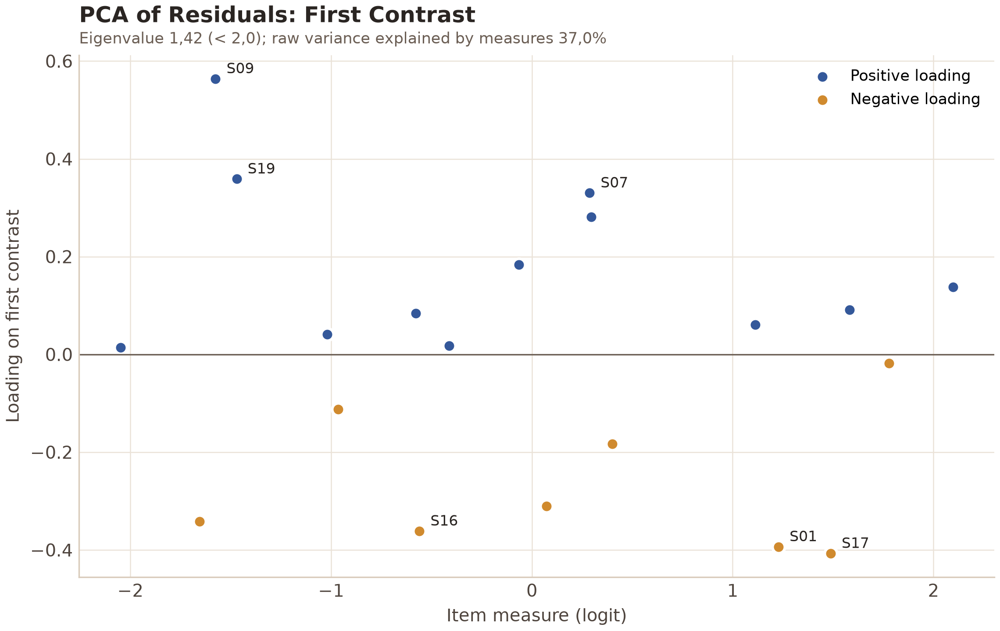

**Cara membaca grafik ini.** Setiap titik adalah satu item; posisi tegaknya adalah loading pada first contrast, yaitu keterkaitan item dengan pola sisa terkuat setelah measure dikeluarkan. Bila item bertitik biru (loading positif) dan oranye (loading negatif) membentuk dua kelompok isi yang berbeda, tes mungkin mengukur dua hal. First contrast eigenvalue di bawah 2 menandakan pola sisa tersebut masih wajar terjadi secara kebetulan.

### DIF Plot: Item Measure by Group

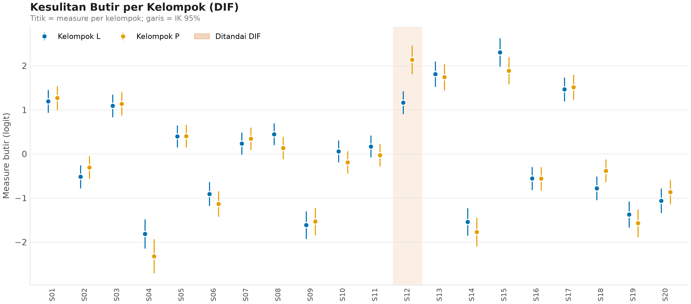

**Cara membaca grafik ini.** Untuk setiap item, titik biru dan oranye menunjukkan item measure bagi masing-masing kelompok, dengan garis tegak sebagai rentang ketidakpastian 95%. Bila kedua titik berdekatan, item berfungsi sama bagi kedua kelompok. Pita merah menandai item yang DIF contrast-nya cukup besar dan bermakna secara statistik sehingga isinya perlu ditelaah.

### Yen's Q3 Matrix

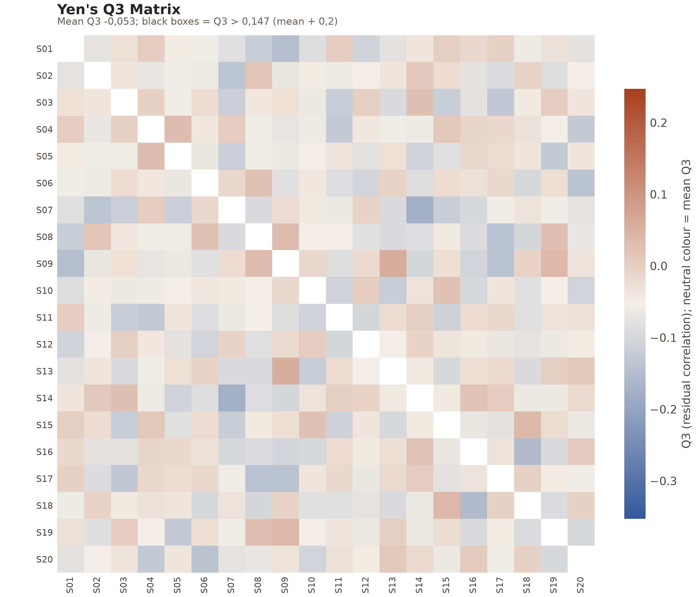

**Cara membaca grafik ini.** Setiap kotak adalah Q3, yaitu korelasi residual antara dua item. Warna pucat berarti tidak ada keterkaitan tambahan; merah pekat berarti dua item saling terkait di luar kemampuan yang diukur (local dependence), biru berarti berlawanan arah. Kotak berbingkai hitam adalah pasangan yang ditandai dan perlu ditelaah, misalnya karena berasal dari satu wacana.

## Rating Scale Model (Andrich) (`contoh_politomus.csv`)

## Ringkasan 1 Menit (Rating Scale Model (Andrich))

- 🟢 **Reliability** (Hijau): Tes cukup konsisten membedakan person (person reliability 0,89, person separation 2,87) dan hierarki kesulitan item-nya stabil (item reliability 0,99).
- 🟢 **Item Fit** (Hijau): Semua 12 item berperilaku sesuai harapan model (Infit dan Outfit MNSQ dalam rentang 0,5-1,5).
- 🟢 **Dimensionality** (Hijau): Data mendukung unidimensionality: tes mengukur satu hal utama (first contrast eigenvalue 1,52 < 2,0) tanpa pasangan item yang saling bergantung.
- 🟡 **Targeting** (Kuning): Rata-rata person measure berada 0,53 logit di atas rata-rata item measure; person cenderung mudah memberi skor tinggi pada item-item ini.
- 🟢 **Category Functioning** (Hijau): Kategori jawaban berfungsi berurutan dan cukup sering dipakai.
- 🟢 **DIF** (Hijau): Tidak ada item yang menunjukkan DIF bermakna antara kelompok L dan P.

Narasi lengkap tiga lapis: [narasi_politomus_rsm.md](narasi_politomus_rsm.md)

### Wright Map

**Cara membaca grafik ini.** Bagian kiri menunjukkan sebaran person measure dan bagian kanan posisi item measure, keduanya pada penggaris logit yang sama. Makin ke atas, makin tinggi kemampuan person dan makin sulit item-nya. Tes yang well-targeted memperlihatkan item yang tersebar setinggi kebanyakan person; wilayah tanpa item berarti kemampuan di wilayah itu kurang terukur. Titik berwarna adalah threshold location tiap item, yaitu titik peralihan dari satu kategori jawaban ke kategori berikutnya.

### Item Characteristic Curve (ICC)

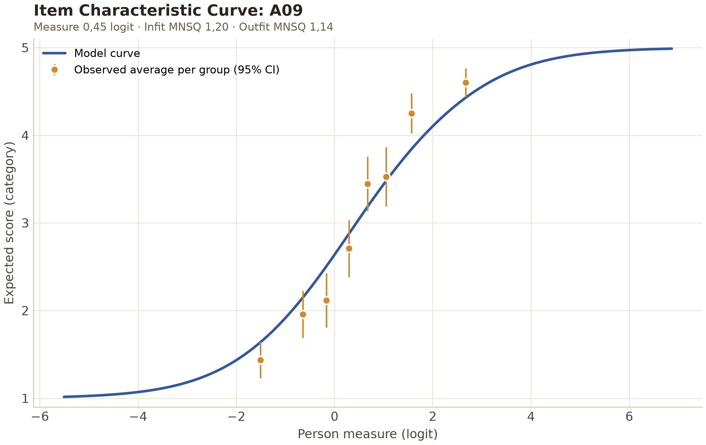

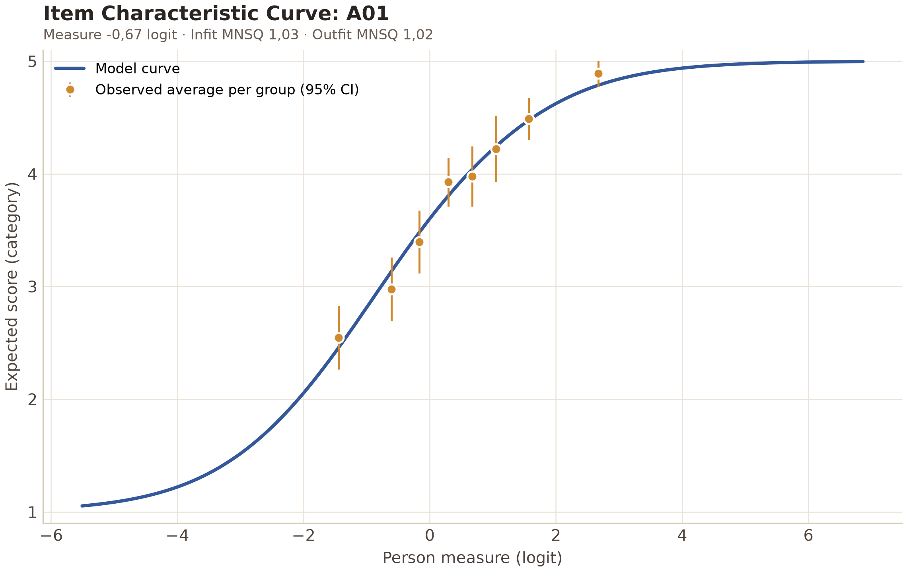

**Cara membaca grafik ini.** Garis biru adalah model curve, yaitu peluang menjawab benar (atau expected score) yang diperkirakan model pada setiap tingkat person measure. Titik oranye adalah observed average kelompok person yang kemampuannya mirip, dengan garis tegak sebagai rentang ketidakpastian 95%. Bila titik-titik mengikuti garis, item berperilaku sesuai model; titik yang jauh dari garis menandakan item yang perlu diperiksa.

### Category Probability Curves

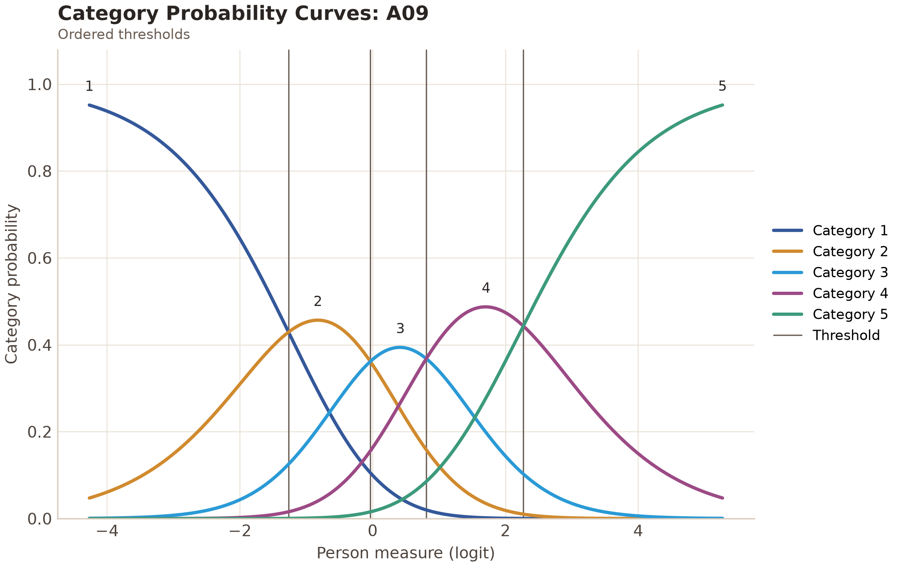

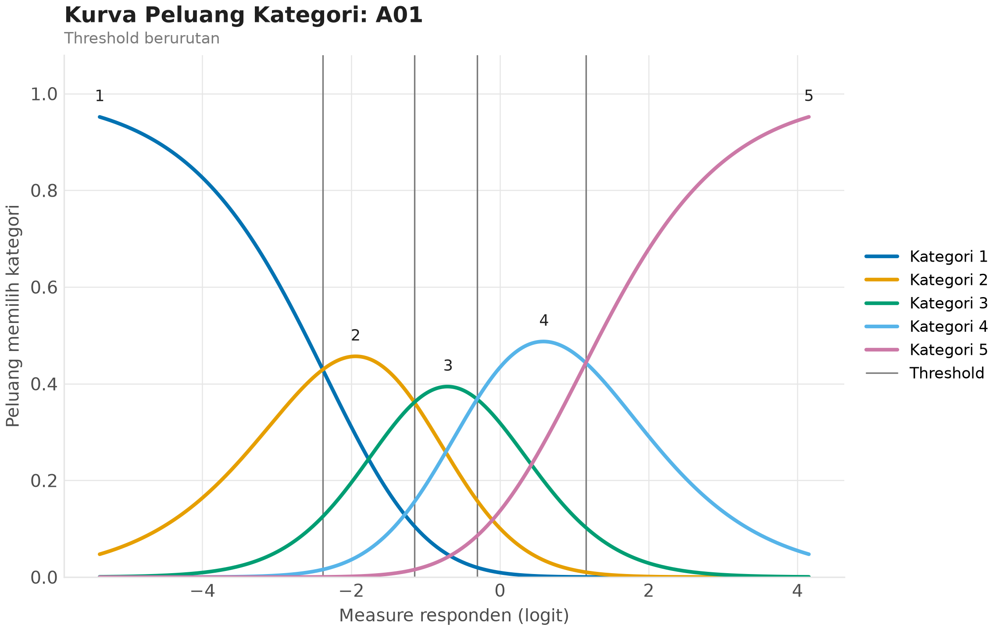

**Cara membaca grafik ini.** Setiap kurva menunjukkan peluang memilih satu kategori jawaban pada berbagai tingkat person measure. Garis tegak adalah threshold, titik tempat dua kategori bersebelahan sama mungkinnya. Pada skala yang berfungsi baik, setiap kategori punya puncak sendiri dan threshold berurutan dari kiri ke kanan; garis merah menandai disordered threshold.

### Expected Score Curve

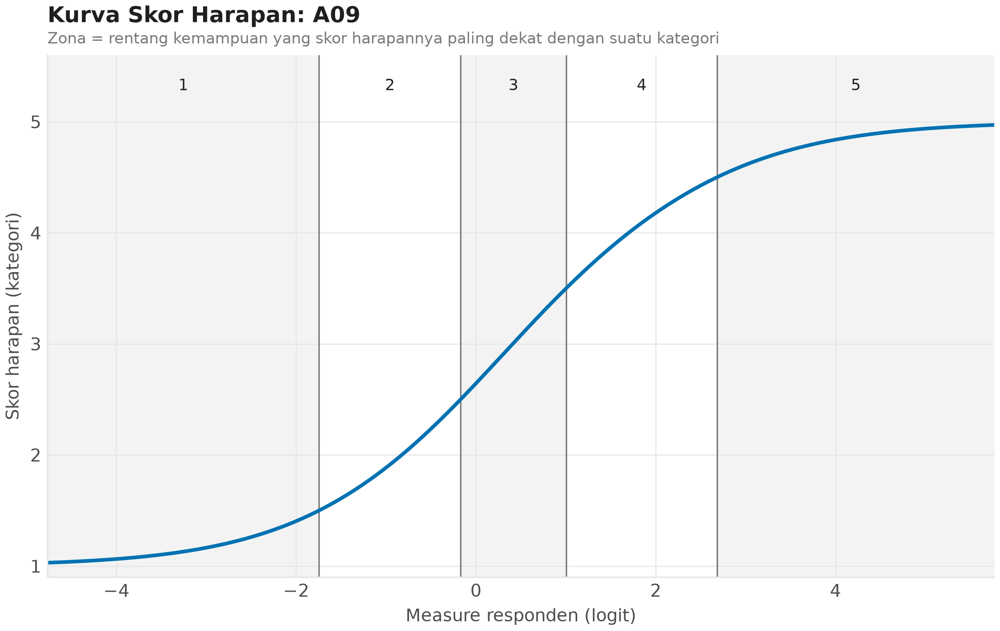

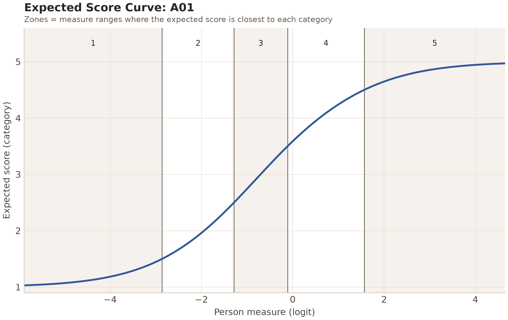

**Cara membaca grafik ini.** Kurva menunjukkan expected score pada item ini untuk setiap tingkat person measure. Pita berselang-seling menandai rentang measure tempat expected score paling dekat dengan suatu kategori. Pita yang sangat sempit berarti kategori itu jarang menjadi skor yang diharapkan bagi tingkat kemampuan mana pun.

### Test Information Function and SEM

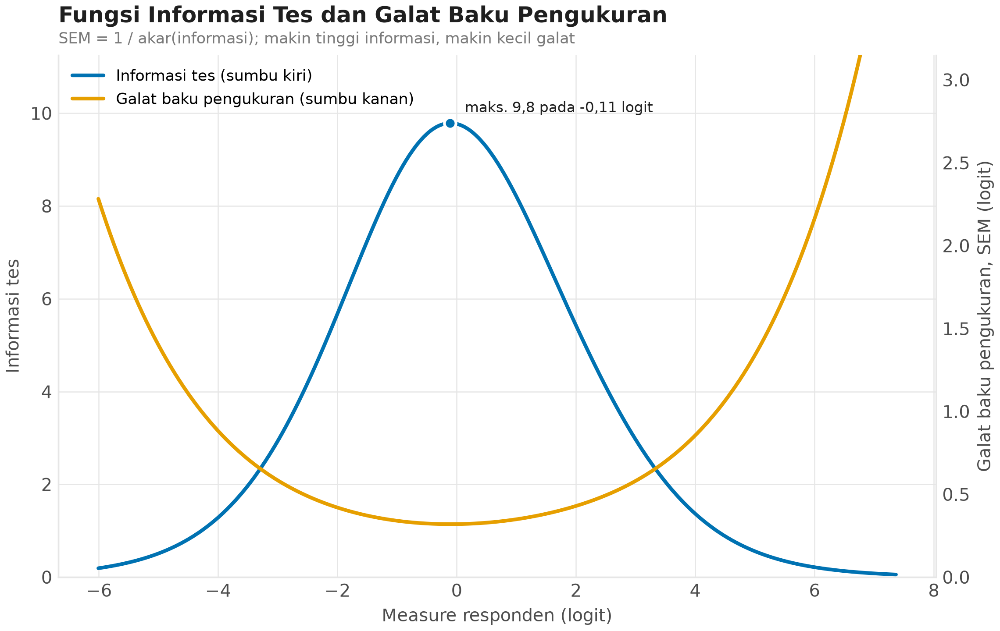

**Cara membaca grafik ini.** Garis biru (sumbu kiri) adalah test information, yaitu seberapa banyak informasi yang diberikan tes pada setiap tingkat person measure; makin tinggi, makin presisi. Garis oranye (sumbu kanan) adalah standard error of measurement (SEM), kebalikannya: makin rendah, makin presisi. Tes paling tepat untuk person yang kemampuannya berada di sekitar puncak garis biru.

### Item Fit Bubble Chart

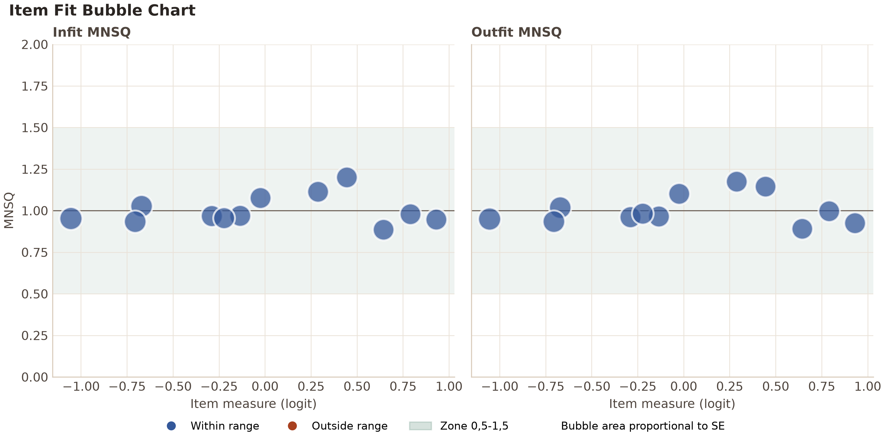

**Cara membaca grafik ini.** Setiap gelembung adalah satu item: posisi mendatar menunjukkan item measure dan posisi tegak menunjukkan Infit atau Outfit MNSQ. Item di dalam pita hijau berperilaku sesuai harapan; item merah di atas pita underfit (terlalu 'berisik'), di bawah pita overfit (terlalu mudah ditebak). Gelembung besar berarti SE item itu besar sehingga estimasinya kurang presisi.

### Person Fit Distribution

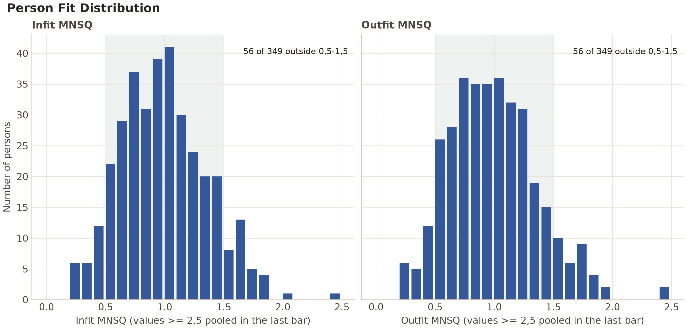

**Cara membaca grafik ini.** Histogram menunjukkan sebaran Infit dan Outfit MNSQ person. Sebagian besar person seharusnya berada di pita hijau di sekitar 1,0. Ekor panjang ke kanan menandakan person dengan pola jawaban tak terduga (underfit), misalnya menebak atau menjawab asal.

### PCA of Residuals: First Contrast

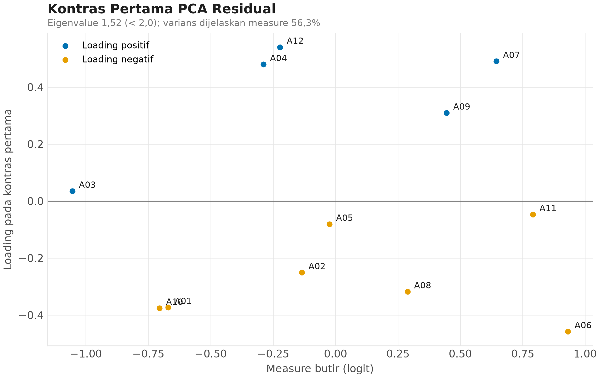

**Cara membaca grafik ini.** Setiap titik adalah satu item; posisi tegaknya adalah loading pada first contrast, yaitu keterkaitan item dengan pola sisa terkuat setelah measure dikeluarkan. Bila item bertitik biru (loading positif) dan oranye (loading negatif) membentuk dua kelompok isi yang berbeda, tes mungkin mengukur dua hal. First contrast eigenvalue di bawah 2 menandakan pola sisa tersebut masih wajar terjadi secara kebetulan.

### DIF Plot: Item Measure by Group

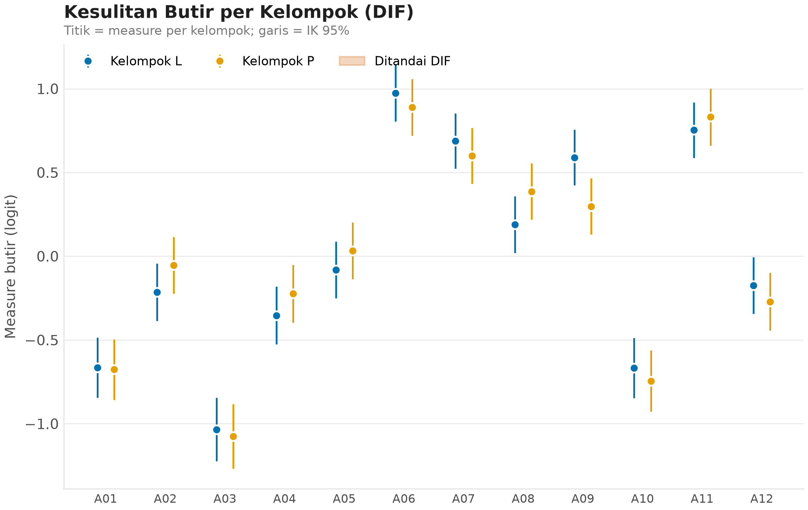

**Cara membaca grafik ini.** Untuk setiap item, titik biru dan oranye menunjukkan item measure bagi masing-masing kelompok, dengan garis tegak sebagai rentang ketidakpastian 95%. Bila kedua titik berdekatan, item berfungsi sama bagi kedua kelompok. Pita merah menandai item yang DIF contrast-nya cukup besar dan bermakna secara statistik sehingga isinya perlu ditelaah.

### Yen's Q3 Matrix

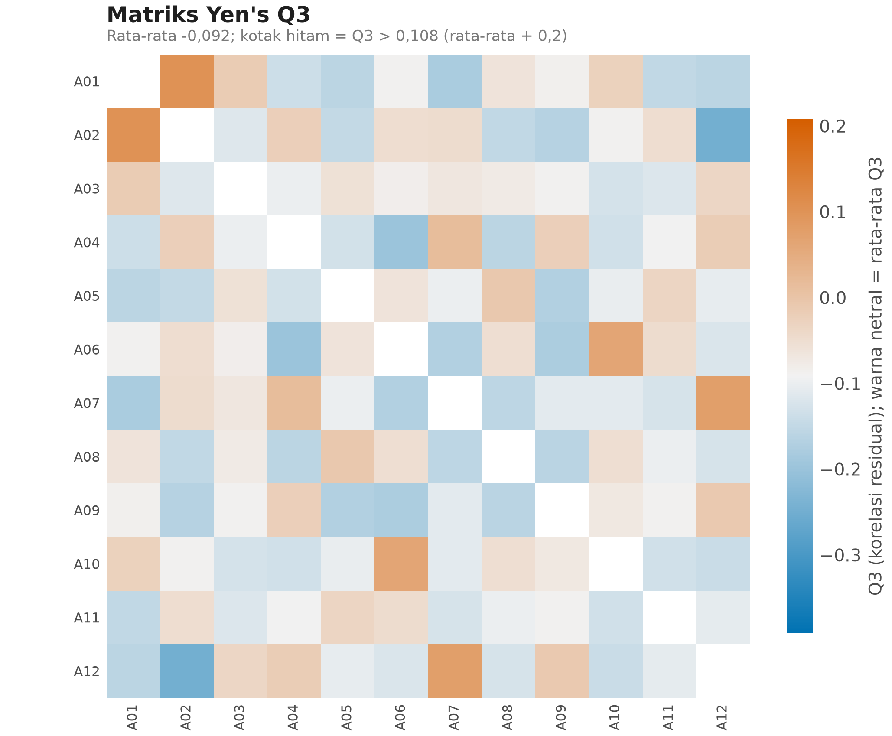

**Cara membaca grafik ini.** Setiap kotak adalah Q3, yaitu korelasi residual antara dua item. Warna pucat berarti tidak ada keterkaitan tambahan; merah pekat berarti dua item saling terkait di luar kemampuan yang diukur (local dependence), biru berarti berlawanan arah. Kotak berbingkai hitam adalah pasangan yang ditandai dan perlu ditelaah, misalnya karena berasal dari satu wacana.

## Partial Credit Model (Masters) (`contoh_politomus.csv`)

## Ringkasan 1 Menit (Partial Credit Model (Masters))

- 🟢 **Reliability** (Hijau): Tes cukup konsisten membedakan person (person reliability 0,89, person separation 2,88) dan hierarki kesulitan item-nya stabil (item reliability 0,98).
- 🟢 **Item Fit** (Hijau): Semua 12 item berperilaku sesuai harapan model (Infit dan Outfit MNSQ dalam rentang 0,5-1,5).
- 🟢 **Dimensionality** (Hijau): Data mendukung unidimensionality: tes mengukur satu hal utama (first contrast eigenvalue 1,53 < 2,0) tanpa pasangan item yang saling bergantung.
- 🟡 **Targeting** (Kuning): Rata-rata person measure berada 0,54 logit di atas rata-rata item measure; person cenderung mudah memberi skor tinggi pada item-item ini.
- 🔴 **Category Functioning** (Merah): Sebagian kategori jawaban tidak berfungsi berurutan: disordered threshold (A09).
- 🟢 **DIF** (Hijau): Tidak ada item yang menunjukkan DIF bermakna antara kelompok L dan P.

Narasi lengkap tiga lapis: [narasi_politomus_pcm.md](narasi_politomus_pcm.md)

### Wright Map

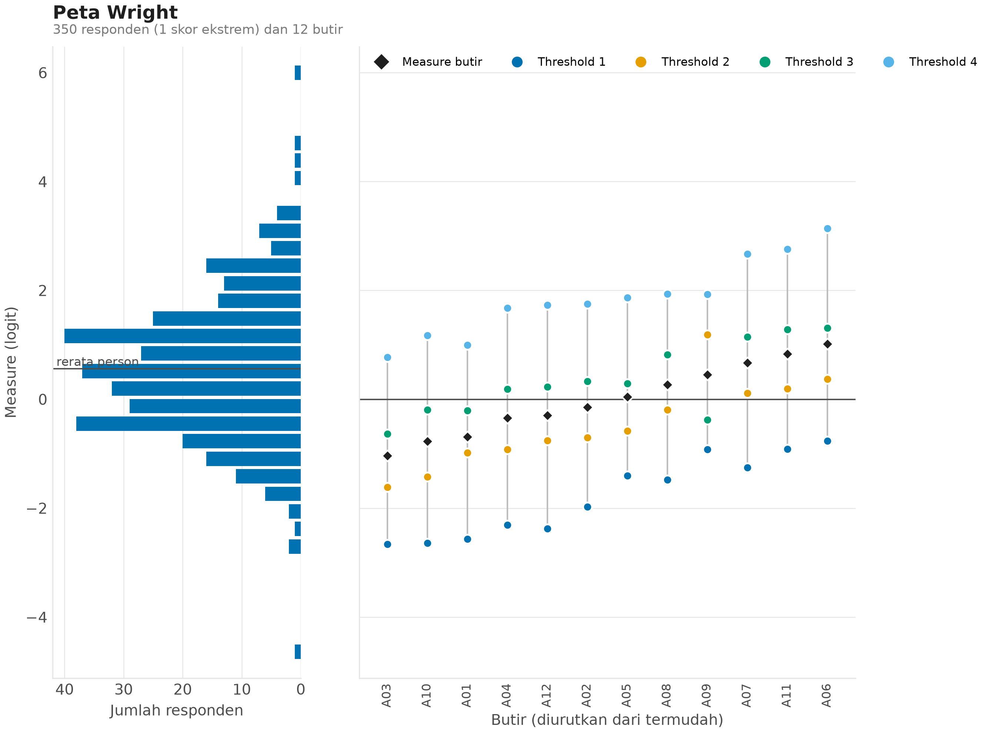

**Cara membaca grafik ini.** Bagian kiri menunjukkan sebaran person measure dan bagian kanan posisi item measure, keduanya pada penggaris logit yang sama. Makin ke atas, makin tinggi kemampuan person dan makin sulit item-nya. Tes yang well-targeted memperlihatkan item yang tersebar setinggi kebanyakan person; wilayah tanpa item berarti kemampuan di wilayah itu kurang terukur. Titik berwarna adalah threshold location tiap item, yaitu titik peralihan dari satu kategori jawaban ke kategori berikutnya.

### Item Characteristic Curve (ICC)

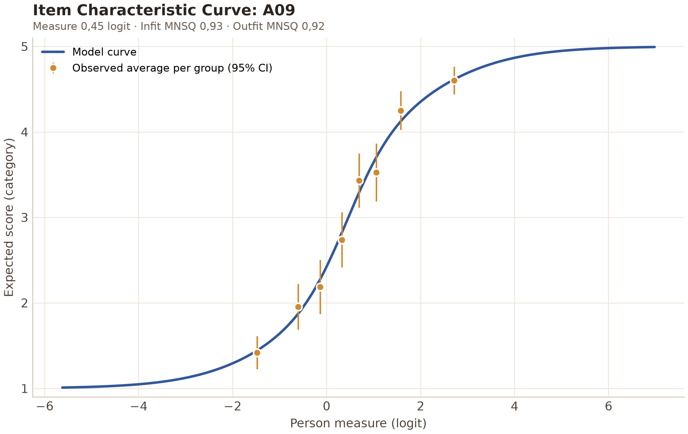

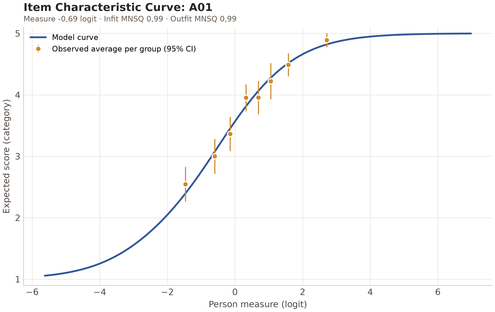

**Cara membaca grafik ini.** Garis biru adalah model curve, yaitu peluang menjawab benar (atau expected score) yang diperkirakan model pada setiap tingkat person measure. Titik oranye adalah observed average kelompok person yang kemampuannya mirip, dengan garis tegak sebagai rentang ketidakpastian 95%. Bila titik-titik mengikuti garis, item berperilaku sesuai model; titik yang jauh dari garis menandakan item yang perlu diperiksa.

### Category Probability Curves

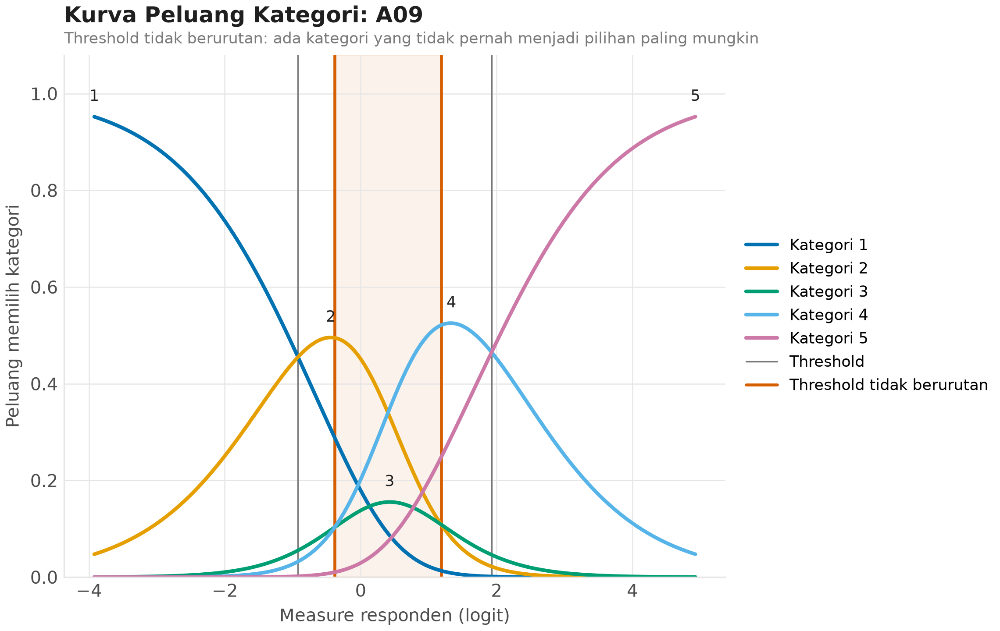

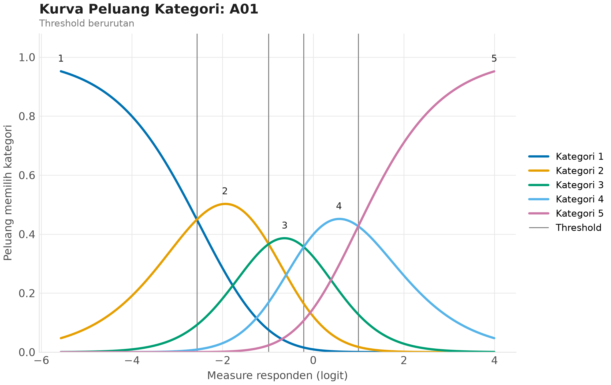

**Cara membaca grafik ini.** Setiap kurva menunjukkan peluang memilih satu kategori jawaban pada berbagai tingkat person measure. Garis tegak adalah threshold, titik tempat dua kategori bersebelahan sama mungkinnya. Pada skala yang berfungsi baik, setiap kategori punya puncak sendiri dan threshold berurutan dari kiri ke kanan; garis merah menandai disordered threshold.

### Expected Score Curve

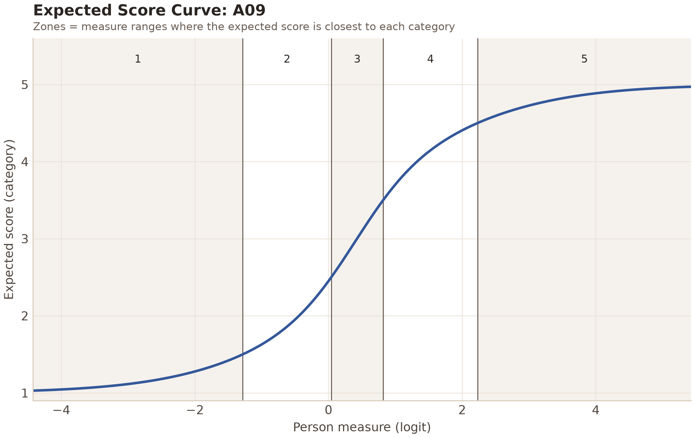

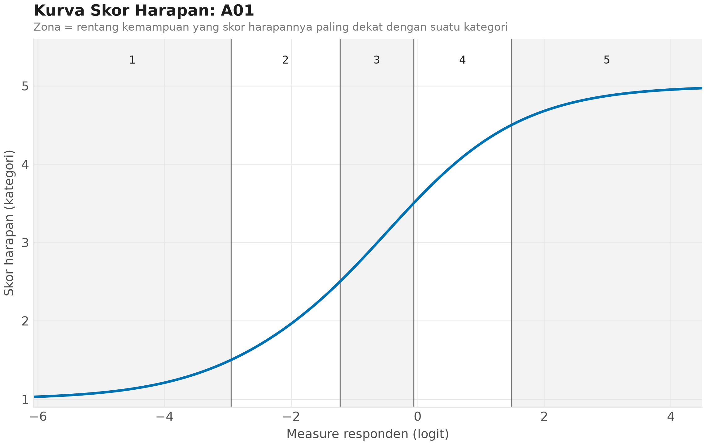

**Cara membaca grafik ini.** Kurva menunjukkan expected score pada item ini untuk setiap tingkat person measure. Pita berselang-seling menandai rentang measure tempat expected score paling dekat dengan suatu kategori. Pita yang sangat sempit berarti kategori itu jarang menjadi skor yang diharapkan bagi tingkat kemampuan mana pun.

### Test Information Function and SEM

**Cara membaca grafik ini.** Garis biru (sumbu kiri) adalah test information, yaitu seberapa banyak informasi yang diberikan tes pada setiap tingkat person measure; makin tinggi, makin presisi. Garis oranye (sumbu kanan) adalah standard error of measurement (SEM), kebalikannya: makin rendah, makin presisi. Tes paling tepat untuk person yang kemampuannya berada di sekitar puncak garis biru.

### Item Fit Bubble Chart

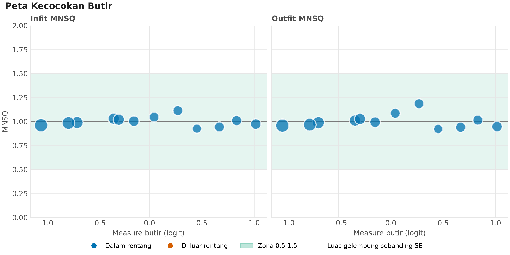

**Cara membaca grafik ini.** Setiap gelembung adalah satu item: posisi mendatar menunjukkan item measure dan posisi tegak menunjukkan Infit atau Outfit MNSQ. Item di dalam pita hijau berperilaku sesuai harapan; item merah di atas pita underfit (terlalu 'berisik'), di bawah pita overfit (terlalu mudah ditebak). Gelembung besar berarti SE item itu besar sehingga estimasinya kurang presisi.

### Person Fit Distribution

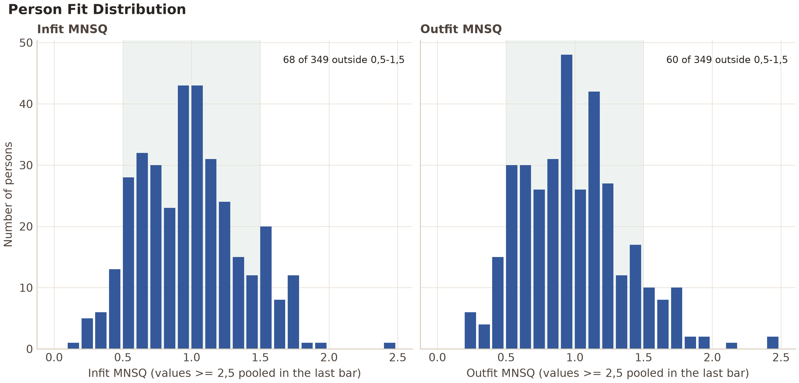

**Cara membaca grafik ini.** Histogram menunjukkan sebaran Infit dan Outfit MNSQ person. Sebagian besar person seharusnya berada di pita hijau di sekitar 1,0. Ekor panjang ke kanan menandakan person dengan pola jawaban tak terduga (underfit), misalnya menebak atau menjawab asal.

### PCA of Residuals: First Contrast

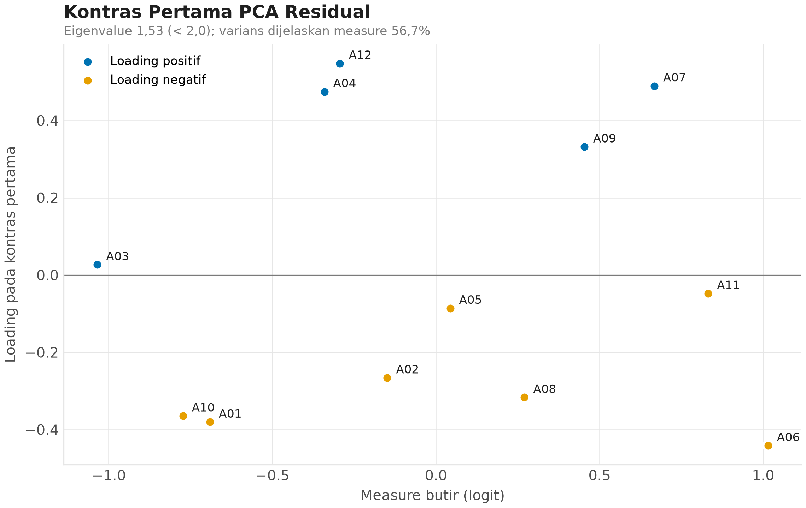

**Cara membaca grafik ini.** Setiap titik adalah satu item; posisi tegaknya adalah loading pada first contrast, yaitu keterkaitan item dengan pola sisa terkuat setelah measure dikeluarkan. Bila item bertitik biru (loading positif) dan oranye (loading negatif) membentuk dua kelompok isi yang berbeda, tes mungkin mengukur dua hal. First contrast eigenvalue di bawah 2 menandakan pola sisa tersebut masih wajar terjadi secara kebetulan.

### DIF Plot: Item Measure by Group

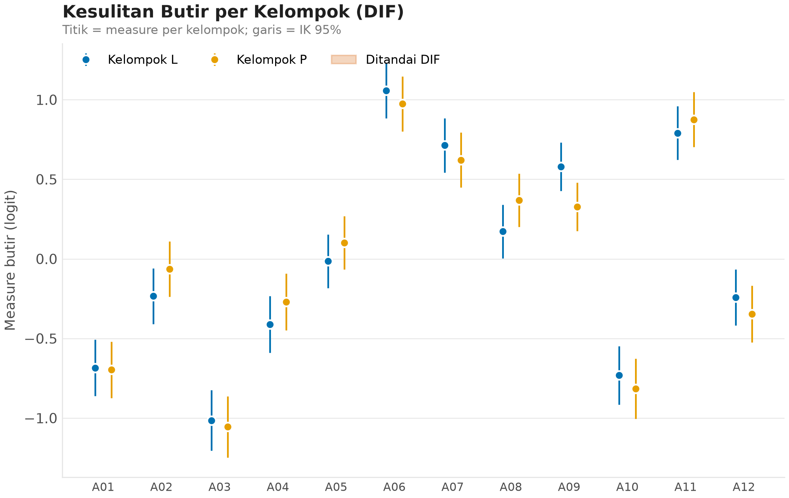

**Cara membaca grafik ini.** Untuk setiap item, titik biru dan oranye menunjukkan item measure bagi masing-masing kelompok, dengan garis tegak sebagai rentang ketidakpastian 95%. Bila kedua titik berdekatan, item berfungsi sama bagi kedua kelompok. Pita merah menandai item yang DIF contrast-nya cukup besar dan bermakna secara statistik sehingga isinya perlu ditelaah.

### Yen's Q3 Matrix

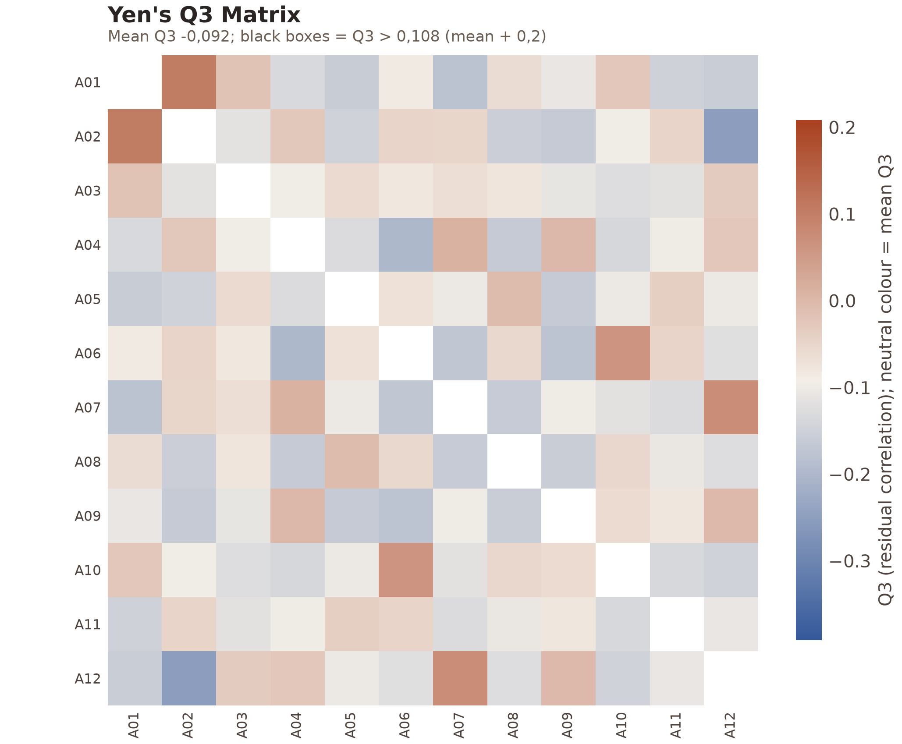

**Cara membaca grafik ini.** Setiap kotak adalah Q3, yaitu korelasi residual antara dua item. Warna pucat berarti tidak ada keterkaitan tambahan; merah pekat berarti dua item saling terkait di luar kemampuan yang diukur (local dependence), biru berarti berlawanan arah. Kotak berbingkai hitam adalah pasangan yang ditandai dan perlu ditelaah, misalnya karena berasal dari satu wacana.
